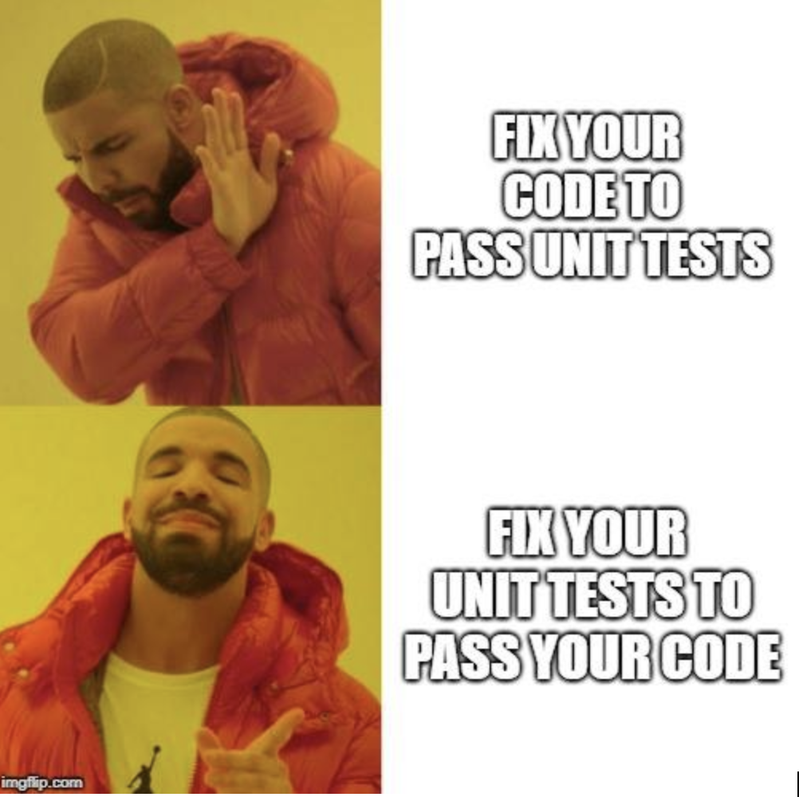

* 스택방식으로 기록
* 각 파트 로그 담당자가 구글 독스 기록완료하면,로그를 여기로 옮김. 
* 이후 자기 파트 수정은 리포지토리 md 수정

ToC
- 20180608 - 5장. 솔직히 말하자면
---------------------------------


## 20181227 - 25장.테스트 주도 개발 패턴 (테스트 목록)


### 우리의 베스트 파트

**ohahohah**
>

**kimsunoh**
>

**RudiaMoon**
>


### 이야기
Ï
**ohahohah**
>

**kimsunoh**

> 경험이 축적될수록 할일 목록이 많아진다. 할일 목록이 많아질수록 내가 하던 일에 대한 집중력이 떨어 지고 성취도는 낮아진다. 성취도가 낮아지면 할일 목록은 더 많아진다. (p.208)

> 

**RudiaMoon**
>


### 회고

**ohahohah**
- 오랜만이네요. 오늘도 늦잠을 자고 싶었으나, 읽으니 좋네요. 

**kimsunoh**
- 오늘 추워서 일어나기 힘들었지만, 읽으니 좋네요. 뇌를 깨우기에 정말 좋은 방법인것 같아요.

**RudiaMoon**


## 20181212 - 25장. 테스트 주도 개발 패턴


### 우리의 베스트 파트

**ohahohah**     

**kimsunoh**
>

**RudiaMoon**
>

### 이야기

**ohahohah**     

> 어떻게 테스트할 것인가에 대하여 자세히 이야기하기 전에 우선 기본적인 전략에 관한 질문에 답해야 한다 . \
?테스트한다는 것은 무엇을 뜻하는가 ? \
?테스트를 언제 해야 하는가 ? \
?테스트할 로직을 어떻게 고를 것인가 ? \
?테스트할 데이터를 어떻게 고를 것인가 ?
- 4가지 질문 해본 적 있나? 첫번째,두번째 질문은 생각해본적이 없다.
 - kimsunoh : 로직을 어떻게 구할것인가. 서비스와 컨트롤이 나눠져있어야하는데 실질적으로 테스트하는 부분이 어디일까라는 고민되게 많이함 .어느 부분이 실질적으로 테스트해야 하는 걸까 이런 방식이 어떻게 해야 하는 걸까. 컨트롤러 테스트
 - 제대로 된 컨트롤러는 컨트롤러 테스트해야 하는 게 맞음
 - 잘 나눠진 모듈은 비즈니스 쪽 테스트가 맞는 거 같은데 대부분 잘 나눠서 져 있지 않다 보니 이럴 땐 어떻게 해야 할까.
 - 레거시를 어디까지 테스트할 것인가 이런 게 밀접한 관련이 있는 것 같다. 저는 비즈니스 산업에서 일할 때 레거시를 하지 않는다. 모두가 공감하는 레거시라면 고친다. 레거시에서 버그가 발생할 경우 테스트 코드는 깔끔하게 되지 않는다. 다른 모듈과 강결합되어 있기 때문에 목객체를 막 쓰면 그러면 또 꼬인다.
 - kimsunoh : 커다란 포도송이에서 포도송이는 보존한 체 뼈대만 제거하는 느낌이 드는 일을 하고 있다. 어떨때 테스트 커버리지를 늘릴 수 있을까. 더 중요한 로직 for무 if문 
    - 완전 찢어 낼 수 없는 상태에서 조금만 떼어낸 상태에서 테스트를 하고 있는데 부분적으로 떼어낸다고 해서 유지보수에서어떤 장점있을까? 생각하게 됨. 레거시활용전략 읽어보셨나요? 저는 답을 찾은게 아니라서 읽어도 모르겠지만 좋은 힌트얻었으면 좋겠다. 과하게 목표를 잡았다. SI프레임워크를 사용하고있는 로직인데 스프링을 적용하겠다. 이게 베스트라고생각해서 하긴했는데 너무커서 이런 로직을 할 수 없다. 7월 8월부터하다가 다른프로젝트 하다가 홀딩되서 최근에 다시 봤는데 손댈 방법이 안나와서, 동료에게 회의 요청함. 회의에서 우선순위를 잡고 프로젝트 진행중에 있음. 누구하나 뼈속까지 작업을해야하는데 이 작업이 의미가 있는지 의문이든다. 일반적으로 이해할 수 있는 상황인건지도 모르겠다. 프로덕션에서 일반적인 프레임워크가 아니고 SI프레임워 쓰고있지만…(이하생략)
    - 이런건 조직이해야하지 않을까. 프레임워크 자체가 문제가있는것 같다. 프레임워크에 대한 이해도, 제대로 사용하고 있다는 것에 대한 이해, 조직차원에서 지원은 같이해보자가 맞다고 생각함.
    - 선임이나 이 프레임워크를 잘 아는 사람이 구조적으로 뜯어줘야하지 않을까? 인력 모자름에서 개선하기엔 부족

> 당신이 변화를 테스트할 수 있다고 해도，실제로 변화를 테스트하는 것은 '테스트 를 갖고 있다'는 것과 똑같지 않다 .  1) 역자 주 : 변화를 테스트한다는 것은 (수작업 ) 테스트의 동사적 의미를 암시하고 , 테스트 를 갖고 있다는 것은 (자동화 ) 테스트의 명사적 의미를 암시한다 . 당신이 변화를 테스트 한다고 할지라도 , 변화를 테스트하는 것은 테스트를 갖고 있다는 것 (자동화)과 똑같지 않다 .

> '테스트할 시간이 없다'의 죽음의 나선 - 스트레스를 많이 받으면 테스트를 점점 더 뜸하게 한다 . 테스트를 뜸하게 하면 당신이 만드는 에러는 점점 많아질 것이다 . 에러가 많아지면 더 많은 스트레스를 받게 된다 . 씻어 내고 다시 반복하라 (rinse and repeat). \
 \
어떻게 하면 이 고리에서 빠져나올 수 있을까 ? 새로운 요소를 도입하거나 , 기존 요소와 바꿔치기 하거나，화살표를 바꾸면 된다 . 이 경우엔 '테스트 '를 '자동화된 테스트'로 치환하면 된다 .

**kimsunoh**

> 그 어떤 소프트웨어 엔지니어도，아주 확신에 찬 사람과 정말 얼렁뚱땅 넘어가는 사람을 제외한다면，아무리 작은 변화라도 테스트하지 않고 릴리즈하지는 않는다. (p.203)

> 스트레스를 많이 받으면 테스트를 점점 더 뜸하게 한다. 테스트를 뜸하게 하면 당신이 만드는 에러는 점점 많아질 것이다. 에러가 많아지면 더 많은 스트레스를 받게 된다. 씻어 내고 다시 반복하라(rinse and repeat8). (p,205)

> 테스트는 프로그래머를 위한 묘 석인데，두려움을 지루함으로 바꿔주는 효험이 있다 (p.205)

> 교훈을 얻었다 (p.206)
- 이분은 자꾸 뭔가 교훈을 얻는다. 그리고 실천한다

> 각각의 테스트는 다른 테스트와 완전히 독립적이어야 한다는 것이다. 즉 문제가 하나면 테 스트도 하나만 실패해야 하고, 문제가 둘이면 테스트도 두 개만 실패해야 한다. (p.207)

**RudiaMoon**

> 어떤 기능을 하나 진행하는 중이라면 다음 번에도 똑같은 목록을 사용하라. 현재 작업 범위를 넘어서는 큰 리펙토링 거리를 발견한다면, '다음' 할일 목록으로 옮겨라.(p.210)
- 기능별로 기존에있던거 따라하면되니깐 유용하군
- 할 일 목록을 똑같은 기능을 다른 것에 쓴다면, 같은 기능들의 묶음을 다른 곳에서도 쓰면 좋을 것 같다는 생각을 했다. (예시 : 문자 개인 확인 API) 공통되는 기능이라서 리펙토링을 하거나 개발할 때 기능을 묶어두면 되는구나 라고 공감하게 됬다. 여기서는 큰일이나 리펙토링 할 것이 있으면 다음목록으로 넘겨라 하는 것을 실천중인데 일을 다 했다는 느낌이 들지 않는다. 주변에서 거의다 일을 하지 않았냐? 하는데 내가 생각했을 때는 세세하게 남아있는 부분들이 있어서, 내가 느끼는 부분이 원활하게 공유가 되지 않는것 같은 기분이 드니깐 고민이된다.
- kimsunoh: 서비스 분리작업에서 다 됐다고 생각했고 이부분은 조금씩 남아있는게 고민되는 부분에 대해서 같이 고민해줄사람이 없다. 이 부분을 고민을 띄엄띄엄하다보니깐 중간에 공백을 메꿔야하는 부분이 있다는 부분에서 공감을 느낀다. '
- 오래 걸리는 작업같은 경우에는 안하는게 맞긴한데, 디테일은 나중에 천천히 맞추자고 하는데, 나중에 신경 안쓰게될 디테일인 것 같다.
- kimsunoh:개인적인 요청으로 회의를했다. 이게 문제가 이것떄문에 딜레되고있고 이부분이 리팩토링이 되야할거 같은데 아직 이 부분이 어떻게 해야할지 모르겠다. 이런걸 피력했다. 일단 리팩토링 신경쓰지말고 서비스부분에 신경써라.라는 피드백이 마음에 안드는게 이 레거시가 내 이름으로 커밋되는게 싫다. 내 이름이 들어가는 부분은 적어도 이해가 되는 레거시였으면 좋겠다.  
- 아니면, 커밋 로그에다가 서비스를 분리하는 작업을 했다라고 남기면, 괜찮지 않을까요? 

> 나는 테스트 케이스 하나라도 '다음' 목록으로 넘긴 기억이 없다. 제대로 작동하지 않는 테스트를 하나라도 생각할 수 있다면, 그걸 제대로 되게 하는 것이 코드를 릴리즈하는 것보다 더 중요하다(p.210)
- 도메인마다 성격이 다른것같다. 이저자는 어떤회사를다니고있을까?
- 테스트 케이스 하나를 늘리기 전에, 릴리즈하기보단 테스트 케이스를 정교하게 하는게 중요하다고 하는데, 이건 회사마다 성격이 다른것 같다. (우형 예시), 자기가 만들었는데, 좀 더 깔끔하게 해야되 라며 몇시간 동안 서비스 딜레이가 되면 크리티컬한 타격이 오기 때문에, 좋은코드 잘 짜는 것도 중요하지만, 최대한 빨리 만들어서 빨리 릴리지를 하는 것이 중요하다고 생각이 되면서, 저사람 무슨 회사에 다니고 있을까? 라는 생각을 하게된다. 다들 도메인 사람들 마다 일 잘하는 사람들마다 대우, 사람에대한 평가가 달라지는것 같다. 
- kimsun :파트장님과 얘기하게되는 부분. 시간을 잡고 분리하다보니깐 리팩토링이 필요하다.라는 입장이고 파트장님은 분리가 더 시급하다. 리팩토링은 나중에하고 분리부터하자라는 입장이여서 RudiaMoon말 듣고 맞는 말이라고 생각한게 기본적인 리팩토링은 깔끔한걸 걸 떠나서 도를 넘지 않는 테스트케이스나 리팩토링이 필요하지않을까. 라고 생각함. 그리고 저를 가르켜준 사람은 리팩토링이 필요없는 코드를 만들어낸다. 물론 이것도 레거시 코드가 되겠지만 이 코드를 이렇게 이해하기 쉽게 한다고? 라고 감탄밖에 안나옴. 그럼 사람은 어느 환경이던 무슨서비를 하던 자기가 짜고싶은걸 예쁘게 짤수 있으니깐 다른레벨이지않을까.  
- Moon : 결론적으론, 회사 이런 부분도 필요하지만, 내가 실력을 키워야겠다.

> 테스트를 작성할 때는 컴퓨터뿐 아니라 후에 코드를 읽을 다른 사람들도 생각해야 한다.(p.214)
- 어려운일이아 이래서 코드리뷰를하는건가 
- 다른사람 코드를 읽으려면, 전 예제에서는 이런식으로 된다. 라는 말을 했었는데, 상대방이 이 수식이 어떻게 나오게 됬는지를 알려주고 설명이 나오는데, 수식관련된 내용이 나왔을때는 다른사람이 이해할만한 수식을 짜는것도 중요하다고 생각이 됬다. 


### 회고 - 181216

**RudiaMoonMoon**
- kimsunoh님 슬립들어온거 축하드려요. 역시 될사람은 되네요. kimsunoh님, 방 별로 투표자 뽑는데 제일 높아요. 네, 그래서 오늘도 기쁜하루가 되시길 바라고, 오늘 공감대가 많아서 동지애가 느껴졌어요. 

**kimsunoh**
- 저도 오늘 공감대가 많아서 좋았고 ohahohah가 못일어난게 저때문인거같아요. 어제 ohahohah랑 얘기하고 싶은게 있어서 와인을 한잔했는데 늦게 들어갔다. 그래서 미안하고 그리고 슬립스터디가 기대됩니다.


### 회고 - 181216(25장 책읽기)

**ohahohah**
- 아침 일찍 일어나니깐 좋네요.

**kimsunoh**
- 후움 월요일 아침이라 일어나기 힘드네요. 이번주가 심히 걱정이 됩니다.

### 회고 - 181214

**ohahohah**     
- 고민타임 좋았어요.

**kimsunoh**
- 말 들어주시니깐 한결 가벼워졌어요.

**RudiaMoon**
- kimsunoh님 화이팅


### 회고 - 181213

**ohahohah**
- 7시에일어나서 기분이좋다. 보통 가로등이나 차소리있어서 시끄러운데 여긴 안그렇다. 환경의 영향이 중요한 것 같다.
- 이렇게 재밌었던 걸 전에 읽었었던 걸 왜 기억못했었지? 하면서 신나게 읽음

**kimsunoh**

아파서 쉬어야했음(진단받음). rudiaMoon 말에 공감. 알고 있는데 왜 하지 못할까? 왜 나는 알고만 있을까? 우리 분명 읽었었나?(다들안읽었다고주장했지만읽었던흔적이남아있다) 이 좋은 내용을 왜기억못했지? 그래서 충격과 공포 속에서 아침을 시작할듯.

**RudiaMoon**
- 오랜만에 책을 읽는 부분이어서, 마음을 훅훅 찌른다. 용감한 사람이 테스트 없이 릴리즈를 올린다 라는 말이 마음을 훅훅 찔렀어요. 테스트를 빨리 짜야될텐데 라고 생각했어요. 왜 알고있는데 하지 못할까? 라는 생각도 든다.
- (오아 - '테스트할 시간이 없다'의 죽음의 나선 - 스트레스를 많이 받으면 테스트를 점점 더 뜸하게 한다 . )


## 20181207 - 181122 로그에 추가 작성

## 20181204 - 방식공유

### 공유해야할것
- 인용문구 로그 공유하는 방식
    - 인용문구 + 왜 그 인용구 공유하려고 하는지 키워드한 다음에 왜 이인용문구를 공유하고 싶은지 코멘트를 달아놓기로 했다.
    - 진도 리마인드
    - 미리 읽어오고 인용구 정리
    - 실전TDD 김창준 데이터베이스프로그래밍 2번끊어서 읽다가 말았다.
    - 내일부터
    - 로그작성(일일로그) - 밀린 로그
    - 이번주 토요일에 이 주제로 어떻게 정리할지 이야기해보자
    - 오프라인 모임 잡아서 or 이번주 토요일에 행아웃으로 
    - 이번주 토요일에 집중적으로 얘기를 해보자
    - RudiaMoon: 아주 예전것을 말하시는 거죠?
    - ohahohah : 3,4개월치 정도인 것 같다.


### 회고

**ohahohah**
- 오전에 하는게 거의 반년 넘어가는데 익숙해졌다가 쉬니깐 어색해진다. 꾸준히 잘했으면 좋겠고 오프라인으로 만나요! 

**kimsunoh**
- 회고가 너무 오랜만. 근데 지금 몸상태가 안좋음. 이번에는 장염에 걸려서. 집중을 할 수 가 없다. 아까도 오랜너무 오랜만인데 몸 상태가 안 좋아서 너무 안좋아요. 집중을할 수 없어요. 이제 오랜만이네 시간 딱막춰들어가야지했지만 못들어갔다. 건강관리 철저하게 해야할것같아요.

**RudiaMoon**
- 오랜만에 쉬는동안 그래도 좋았어요. 네, 이상입니다.


## 20181122,1207,1211 - 데이터베이스 프로그래밍 TDD


### 우리의 베스트 파트

**ohahohah**
>

**kimsunoh**
>

**RudiaMoon**
>


### 이야기

**ohahohah**     

> 글을 가져온 곳이 메모리건 파일이건 데이터베이스건 결국은 저장소 인 것이다. 저장소에 대해서도 정보 은닉의 개념을 적용할 수 있다.(366)
- 다른 객체, 다른 부분에서는 메모리,파일, 디비 어떤 걸 사용하던지 이 모듈의 역할은 저장소이다. 정보 은닉!
- 정보은닉을 할때 프로세스가 돌아가는 부분을 보이지 않게 한다. 객체지향의 모듈간의 통신이기 때문에 협력이라는 말을 많이 하는데, , restfull aPI할때  요청과 응답의 룰이 정해져 있는데, 이것과 마찬가지로, 내부의 로직이 어떻든 어떤 방식으로 대화를 할지가 정해져 있는 것 같다. 그래서 정보은닉의 개념을 적용할 수 있는게 아닐까? 라는 생각이 들었다. 
- 신선해요. 신박한생각

> 모의 객체를 이용할 때는 두 가지 테스트가 같이 필요하다 . 모의 객체는 말 그대로 모의 객체기 때문이다 . 모의 객체에서는 테스트를 잘 통과하는 데 , 실제 객체를 이용했을 때는 테스트를 통과하지 않을 수도 있다. (...) 
- 각 경우별로 적절한 대응을 한번 더 짚어주어서 좋았음
- 목객체가 헷갈림. 클린코드수업들을 땐 TDD니깐 충분히 쓸수있다고했음. 목객체에선 테스트 통과하는데 실제데이터는 통과안해서 이 테스트 필요.

> * 모의 객체 테스트시 성공，실제 객체 테스트시 실패 : 이에 대해선 실제 객체의 이용 상태를 확인해야 한다 .  \
> •모의 객체 테스트시 실패 , 실제 객체 테스트시 성공 : 모의 객체가 완전히 구현되지 않은 것이다 . 하지만 모의 객체는 어디까지나 보조 도구이므로 구현하는 데 해야 하는 일이 너무 많다면 무시해도 무방하다 . \
- 모의 객체는 모의 객체일뿐! 구체적으로 짚어줘서 좋음

•둘 다 실패 : 제대로 구현되지 않은 상황이다 . 일단은 실제 객체에 대 한 테스트에 대해 주석 처리를 하여 테스트 실행을 막은 후 모의 객체 일 때부터 실패한 테스트들을 차근차근 통과시 키자 .(370)
- 실제 객체 테스트 진행을 막은 후, 모의 객체 테스트부터 통과
- 라이브러리, 프레임웤등을 사용해서 디비 테스트할 필요없다고 생각. 자바 코드레벨 말고 실제 CRUD에 대한 테스트는 어떻게 해야하는가. 이번 장은 목객체 사용에 대해 이야기해서 좋음

**kimsunoh**

> 글을 가져온 곳이 메모리건 파일이건 데이터베이스건 결국은 저장소인 것이다 (p.366)
- 요새 개발자라는게 어떻게하면 원하는 정보로 다듬어서 넘겨줄까 이런거 많이 생각하고 있어서 적은문장
- RudiaMoon : 제가 생각하는건 DB에서 테이블에 컬럼이 abc가 있을때 a만 다듬어서 보여준다는 의미 일까요?
- ohahohah : rudiaMoon이 말하는건 a를 셀렉트해서 넘긴다. 라는 말인 거잖아요? 그런데 
- 통계데이터를 만들어주는건 디비데이터 셀렉트해서 원하는 정보 넘겨주는데 저장소에서 데이터 가져와서 효율적으로 가공해서 출력함. 프로그래밍 모든 로직에 입력과 출력에서 가운데 프로세스를 깔끔하게 전달할 수 있을까 효율성 고민중. 데이터 베이스는 저장소다라는건 명확하지만 추상적이다. 
- ohahohah : 안에 로직을 얼마나 깔끔하게 전할수있을까

> 중복 부분을 리팩토링하며 그 사람이 만들어낸 코드인데, 텍스트 코드 내의 query 문을 순서 에 맞게 실행한다. 이를 이용해서 setup과 tearDown시에 미리 만들어놓은 데이터를 세팅할 수 있다 (p.371)
- 신박한 방법인거같다. 더미 디비 만들어놓자. 이거 기억할만함.

> 이 복음을 다른 프로그래머들과 함께 공유했으면 하는 바람이다. (p.375)
- 저도 공감

**RudiaMoon**

> 실제 DB를 이용한 테스트가 많으면 많을수록 테스트 실행 속도가 많이 느려진다. 테스트는 TDD가 진행될 때마다 실행되므로 느려지면 상당히 피곤해진다. 이 경우 모의 객체를 같이 섞어서 프로그래밍하는 것이 좋겠다. 그리고 실수하기 쉬운 것 중 하나가 DB 테스트 후 DB 환경을 원상 복구하지 않고 TDD를 진행하기도 하는데, 이 경우 처음 테스트를 통과하는 코드를 작성할 때는 잘 돌아가다가 테스트가 두 번，세 번 돌아갈 때는 실패하기도 한다. 테스트 코드에서 setUp/tearDown 부분 등에서 DB 의 상태를 원상 복구해야 한다.(p.374)
- 모의 객체 필요! 테스트는 원상 복구해야 함.
- 기억해 놓으려고 적어놨다.
    - junit은 테스트를 순서대로 테스팅하지 않으므로, 테스트할 객체 상태가 제대로 세팅되지 않아서 당황했었던게 생각이 났다. 각 테스트 케이스마다 객체 초기화를 다르게 해주는 것이 있는데, 객체를 테스트 케이스 안에서 만들다보면 나중에 꼬이게 되니깐 이부분은 아직도 고민이 된다.
    - 테스트케이스 사이사이에  setUp/tearDown을 해주지 않아서 초기화를 안하고 테스트를 초기에 많이 했었던 것 같다. 그렇게되면 체가 초기화가 되지 않아서 많이 당황했었던 기억이 난다


### 20181211 회고 

**ohahohah**
- 일곱시정도에 잠이깨서 좋았다. 이게, 진짜 어… 컨디션이 좋네요. (제주도라 그런가요?) 쫌, 규칙적인 시간에 자서 그런 것도 있고, 빗소리에 잠이깨서 그런것 같아요. 지금 하늘에서 새들 엄청 날아다니고, 바로 바다가 보이고 너무 좋다. 어제도 그렇고 약간 피곤하신것 같아서 고민이 됬어요. 회고 끝난 다음에 같이 내일 읽을 분량 얘기해보면 좋을 것같다.

**kimsunoh**
- 오늘 엄청 고민이 되었다. 너무 추워서 이불 밖으로 나오는게 고민이 되었다. 이렇게 이불 밖 나와서 하니까 좋다. 어제는 '다음에 읽고 내용 채워넣을게요'이야기했던걸 실제로 실행했다. 읽고 같이 이야기해볼 수 있어서 좋았음. 저 혼자서도 이 파트를 오래 읽은 거 같아서 다음에는 그러지 말아야지 했다.

**RudiaMoon**
- 이렇게 천천히라도 책 읽은 내용을 마무리할 수 있다는게 좋다.


### 20181207 회고 

**ohahohah**
- 오랜만에 만나서 반가웠고요. 어제 늦게 자서 오늘은 쉴게요. 하길바랬는데 포기하고 시작했어요. 한문장 이야기하는게 좋아요. 저도 이것저것일이있어서 쉬었는데 개발하고 싶다. 프로그래밍으로 피드백오는건 좋아요. 약간걱정되는게 여러분들이 바쁘고 아파서 걱정이 많이 됐어요. 근황도 얘기해주세요.

**kimsunoh**
- 목보호대를 샀어요. 거북목이 덜 온다고해서 샀는데 사이즈잘안 맞는거같아요. L자로 사세요. 목 뻐근함이 덜해요. 
- 메인프로세스 정리하고있는데 스프링 하다못해 자바의 틀은 가자. 여러가지 시도하고있어요. 예전코드를 쓰자니 깔끔하지못하고 지금껄쓰자니시간이 많이 걸려요. 
- ohahohah : 코드개선해도 코드 유지하기 힘들어요. 레거시 헤쳐나가야 하는데 이런게 되게 힘들어요. 근데 우리는 레거시가 아니라 잘 만드는 거니깐. 문서나 wiki, 협업잘하는 방법 필요하지 않을까.

**RudiaMoon**
- 숙제를 하기 위해서 30분 일찍일어나서 작성을 했다. 아침에 계속 TDD를 하려면, 노트북을 회사에 놔두고, 회사 노트북으로 했었는데, 오늘 방식을 바꾸고 블투 키보드로 폰으로 했다. 좋은것 같다.  오늘 오랜만에 하는데 분위기가 좋아서 좋았다. 생각을 한건데 확실히 위엣사람이 없으면 스트레스가 많이 쌓이는 것같다. 버그가 생기면 적어놓고 그것을 해결하면 되는데, 기능 개발을 할 시간이 부족한 것같다. 그래서 할일목록이 너무 쌓이고 있어서 너무 스트레스를 받는 것 같다. 지금 상주로 나와있는데  담주에 복귀다. 버그와 기능개발이 동시에 실행하기에 힘들다. 
- TDD를 적용하려면 힘들긴 하지만, 연습이 필요하긴 한데 연습이 어려우니깐… 
- ohahohah : 버그가 많다고 하니깐 테스트 코드에 대한 생각을 해서 물어봤다.
- 이게 버그가 디테일을 잡아야 하는 거여서, 그걸 말하고 싶었다. 디테일 한 것은 (중략)


### 회고

**ohahohah **

-  책에서 나온 방식 필요한지의문 요즘 마이바티스쓰기때문에 JPA은쓰지않아서 나중에 다른곳에서 TDD CRUD들어가는지 확인하는거 필요함 이번장 셀프션트 목객체 생각해서 읽어봐야겠다

**kimsunoh**

- 링크와 프레임워크 있는지몰라서 해봐야겠다 DB도 TDD하는게 마냥 어렵진 않겠구나. 라는 생각을 하게 됬다.

**RudiaMoon**

- 무슨말인지 잘 이해가 안된다. 다시 읽어봐야 할 것 같다.


## 20181113,20181115,20181116,20181119 - 부록.실전TDD- 네트워킹 프로그래밍


### 우리의 베스트 파트

**ohahohah**
>

**kimsunoh**
>

**RudiaMoon**
>


### 이야기 {####-이야기}

**ohahohah**     

> 실제 그 서버가 하는 일，즉 로직 부분을 먼저 작성했다 . 보통 개발할 때 네 트워크 프레임워크부터 작성한 후 로직을 작성하는데 , TDD 로 접근할 때 는 로직에 해당하는 부분에 먼저 접근하는 것이 좋다 . 네트워크나 GUI 부 분을 먼저 작성하면 다른 라이브러리에 대해 의존성이 발생하고，테스트 구현-리팩토링의 리듬이 길어지기 쉽기 때문이다 . DTSTTCPW를 상기해 보자 . (p.355)
- 말이 쉽지 '간단한 것'을 찾아내기가 어렵다

> 이를 이용하면 UpperServer가 Socket 객 체의 스트림 객체를 직접 얻어서 대화할 필요가 없다 . 즉 , 외부에서 사용 하기에는 더 간단한 인터페이스가 된다 .(355)
- 목객체 테스트하면 목칠하지말라고하는데 그만큼 의존성이 많아짐. 어느 정도 까지 목을 써야할까 고민됨. 스프링에서 설정불러와서 junit 사용하는 방법이있고 목을이용해서 하는것이있는데 다른분들은 어떻게 사용하는지 궁금함
- RudiaMoon: 간단하게 작성하는 것도 어느정도 알고 있다. 너무 의존성 있게 만들지 말라는건 알 것 같은데, 적정성을 찾는 다는건 적정선의 룰이 있는 것 같다. 스스로 해보다가 목객체를 많이 썼으니, 다음엔 조금 적게 써볼까? 라는 등의 개인적인 경험치가 있는 것 같다
- ohahohah: 의식적인 수련으로 경험치로 쌓아야 할듯. 짬밥 yo
- 목객체 안쓰면 테스트할때 지저분해짐 여기서 말하는 간단하게 만들려먼 객체를 분리해야하나싶은데 FP(펑셔널프로그래밍)에서 객체마다 어떻게할지 궁금. 
- 객체에서 펑셔널넘어간거라 별반 다를게없다 모듈을 명확하게 관리하기 위해서 oop를 써야하는게 아닐까?
- FP 패러다임이 모듈단위가 함수가 아니라 동작으로 보기
- 코틀린 다음에하면어때요.  널처리, 예외처리 등등이 없어서 로직에 집중하는 명확한 프로그래밍가능

> 하지만 단점이 있다. 모의 객체를 이용할 때는 테스트가 잘 돌아가는데, 실제 작동은 제대로 되지 않을 수 있다. 그러므로 TDD를 처음에 진행할 때는 모의 객체를 이용하되，어느 정도 코드 구현이 진행되면 실제 객체를 이용한 테스트도 같이 실행하자
- 앞문장 이야기 할때도 목객체 이용하면 복잡하다. 이걸 많이쓰면 지저분해짐 어느 정도 코드 구현이 진행되면 실제 객체를 이용한 테스트로 바꾸자



 > 구현하면서 단계별로 테스트를 돌리도록 하자 (p. 357)
 - 테스트를 만들고 나서 테스트를 수정함?
- Sunoh : 기능 수정시 언뜻언뜻 하게 됨
- Rudia : 실제론 안해봐서 모르겠음
- 단계별로 수정하는게 신기했음
- 테스크단위 단계단계가 서버커넥션을한다 그러고 선더만들고 
- 예전엔 할일목록은 나오나 단계별로는 안나옴 할일목록에 순서있는게 신기함 'Do The Simplest Thing That Could Possibly Work(제대로 돌아가는 가장 간단한 것을 하라)'과 이 말이 연관됨. 
- RudiaMoon: 적어놓은 할일목록을 실제 실행할때는 적혀있는거 부터 어떻게 구현할지 순서별로 정리하면서 TDD함. 그게 단계별로 한다는 말과 연관됨.
- Sunoh : 할일목록의 우선순위와 단계별 작성은 다른 거 같다. 만들어지면서 우리가했던거에서 형태소분석에서 리젝스쓰면서했을때 문자얼만드는걸 클래스객체만들었다 

> 이렇게 함으로써 소켓을 바로 이용하지 않아도 테스트 코드에서 upper 서버의 upperRespond 메서드가 제대로 기능하는지 확인할 수 있다. 테스트를 돌리고 확인해보자. 제대로 작동하는 것을 테스트를 통해 확인했으면 실제 소켓 객체를 이용해서 계속 TDD를 진행하자(p,359)
- 단계별로 구현하니 어떤 단위로 구현해할지 앎.  3단계를 구현할때 앞선 단계에서 구현되지 않은 다른 부분을 mock 객체를 사용. 즉, mock 객체를 어떤 부분을 쓸지 판단이 됨(의존성이나 굳이 지금 단계에서 구현할 필요가 없는 것들). 이렇게 3단계를 테스트하고 넘어감. mock객체를 실제객체로 구현하는 단계가 나중에 생김. 그럼 3단계 구현부분에서 mock객체가 실제 객체가 되었을때 3단계의 mock객체를 실제 객체로 수정함. 

> 어떠한 방법으로 얻어오는지 클래스의 이용자(클래스에도 일종의 서비스 제공자와 서비스 이용자의 개념이 적용된다)가 신경 쓰지 않아도 된다. 즉 일종의 정보 은닉(information hiding)이 된다. 이는 디자인을 더욱 유연하게 하는데，(...) 이를 Self-Shunt 패턴이라고 한다. TDD하는 중 입력-결과 테스트(블랙박스 테스트)가 어려울 때 모의 객체나 Self-Shunt 패턴을 이용하면 객체 내부의 상태 변화 과정에 대한 테스트(화이트박스 테스트)가 가능해진다. 이에 대해서는 각 모듈의 내부 상태에 대해 로그를 작성하기 위한 객체를 만들 수도 있다. (365)
- 예전에 책에 셀프션트 패턴이다 하고 짧게 나왔고 그때도 모르겠다고 했음. 아직 완전히 이해안감.
- 토요일에 셀프션트 패턴 같이 얘기해보자. 그 전에 
- [ ] 셀프션트 패턴이 무엇인지 찾아서 이해해오기

**kimsunoh**       

> XP에서 주문처럼 불리는 'Do The Simplest Thing That Could Possibly Work(제대로 돌아가는 가장 간단한 것을 하라)' 를 생각해볼 때 만들어야 하는 프로그램도 여러 가지 간단한 작업 묶음으로 나늘 수 있다. (p.353)
- 간단한 작업을 파일을 읽어올 수 있다 없다로 생각했었다. 소켓접속 등 (더 세부적인)이 단위로  나눠서 할수도 있구나

> 보통 개발할 때 네 트워크 프레임워크부터 작성한 후 로직을 작성하는데, TDD로 접근할 때 는 로직에 해당하는 부분에 먼저 접근하는 것이 좋다 (p.355)
- (로직에 먼저 접근할)그 이유가 뭘까? 나머지 네트워크 부분은 응용소프트웨어 개발 부분이라서 그런가? 
- ohahohah: 그 이유는 RudiaMoon 발췌부부에 있다. '네트워크나 GUI 부분을 먼저 작성하면 다른 라이브러리에 대해 의존성이 발생하고，테스트-구현-리팩토링의 리듬이 길어지기 쉽기 때문이다.(p.355)'
- sunoh: 로직이라고 해서 라이브러리에 대한 의존성이 없는건 아닌데

> 좋은 방법으로는 Socket 객체를 감싸는 UserConnection이라 는 클래스를 만들어내는 것이다. 이를 이용하면 UpperServer가 Socket 객 체의 스트림 객체를 직접 얻어서 대화할 필요가 없다. 즉, 외부에서 사용 하기에는 더 간단한 인터페이스가 된다.(p.355)
- 좀 더 의존성을 줄일 수 있구나 

> 웹 서버에 접속하는 부분부터 만들어야 할 것 같지만 실제로는 어떠한 부분이 먼저 작성되건 상관없다. 즉 중간 중간 의존성을 가지는 부분에 대해 임의의 데이터를 이용하면 된다. 각각의 일은 독립적으로 구현 할 수 있다. (p.362)
- tdd로 보면 어떤 입출력인지 잘 정의되면 이렇게도 할 수 있다. 이게 맞는 말인데 왜 나는 이런 생각을 못해봤을까?라는 생각에 적어봤다.

**RudiaMoon**

> 개인적으로는 DTSTTCPW의 질문 형태를 더 좋아한다) 만들어야 하는 프로그램도 \
여러 가지 간단한 작업 묶음으로 나눌 수 있다.제대로 돌아가는 가장 간단한 것은 무엇일까?(p.353)
- DTSTTCPW를 알게 되서 좋았음. Do The Simplest Thing That Could Possibly Work(제대로 돌아가는 가장 간단한 것을 하라) 이였다. 로직 작성할때 어렵게 느껴지면 힘든데 쉽고 간단하게 빠르게 구현할 수 있어서 좋으니까. 이 부분이 좋았다.

> TDD로 접근할 때는 로직에 해당하는 부분에 먼저 접근하는 것이 좋다. 네트워크나 GUI 부 \
분을 먼저 작성하면 다른 라이브러리에 대해 의존성이 발생하고，테스트-구현-리팩토링의 리듬이 길어지기 쉽기 때문이다.(p.355)
- 전에 실습했을때 UI도 하면 좋지 않나 하고 생각했었는데 의존성때문에 다른 테스트케이스가 깨지기 때문에 UI보다 로직을 먼저 하면 좋겠구나 생각함.
- UI는 테스트 불가성. 다른 라이브러리 사용해서 의존성사용할때 이야기라서 실습과 관계 없는 얘기이고 우리는 실습에서 의존성이 있어서가 아니라 필요가 없었다. 언제가 결과가 뻔한결과라 할 필요가 없었다. 로또게임 할때 랜덤함수, 결과값이 달라지니깐 테스트를 할 수 없는거고 그래서 UI를 할 필요 없었다. 


### 20181113 회고 

**ohahohah**
- 저는 왜 자꾸 잠이 없어져요. 5시에 일어났어요. 
- 이번 파트는 분량이 많아서 끊어져서 읽게됨. 근데 실제로 현업에서 하지 않는 내용들(네트워크프로그래밍,지유아이)이다보니 예제가 와닿지 않는다. 다른 거에 비유해서 읽을 수는 있지만. 음.

**kimsunoh**
- 저번주에 알람이 계속 안울렸었음. 행아웃은 30분에 전화가 오니까 참여할수 있겠지 했었음. 어제는 스터디 시간보다 늦게 일어났음. 알람을 새로 등록했음. 내가 그동안 알람을 신경안쓸 정도로 나태해져있었구나 생각. 이번주는 열심히 참여하겠음.

**RudiaMoon**
- 오늘 아침에 쉴까하고 마음이 흔들렸는데, **kimsunoh**가 메시지해서 마음을 다잡았어요. 행아웃 삭제하고 다시 설치하니까 인제 알람이 울리네요.


### 20181115 회고 

**ohahohah**
- 개인적으로하는 TDD를 안한지 너무 오래되서 코딩을 손 놓은지 오래되었다. 상반된 두 분야를 공부하고있어서 힘들어요. 딥러닝하면 선형대수랑 통계를 해야하니깐. 코딩으로 즉각적으로 반응오는게 그리울때가있다. TDD를 해야겠다.오늘도 화이팅!

**RudiaMoon**
- 오늘은 스트레스를 이기고 티디디를 해서 좋았고요. 왜 저는 바쁜데 다들 프로젝트에 여유가 있을까요. 그 모습이 부럽네요. 스트레스를 많이 받고 있는데 그래도 티디디는 빼먹지 말도록 노력할게요.


### 20181116 회고 

**ohahohah**
- 이부분이 네트워크라서 안와닿을거야생각했는데 그부분 찾아봤는데 아직잘 모르겠다. 데이터, 셀프션트, setup, 테스트데이터 여러방식으로 이야기 확장가능할같다

**kimsunoh**
- 마지막에 코틀린이 null처리 안해서 깔끔하다는 이야기를 했다. 자바를 처음만들때  티디디라는 방법론이 있었으면 null이라는 개념이 안생기지 않았을까?라는 생각이 들었다

**RudiaMoon**
- 저도 사실 많이 와닿지는 않는 것 같다. 그래서, 약간 침묵하는 경향도 있는 것 같다


### 20181119 회고 

**ohahohah**
- 뭔가 이야기하면서 적힌 부분보다 확장해서 이야기하게됨
- 로그 한 명 적으니 로그를 적는데 부하가 생김.
- 다음 문장(셀프션트)도 얘기해야할것도 많은데 혼자 얘기해서 아쉬움

**kimsunoh**
- 오랜만에 출근 준비 하면서 듣고 이해하고 하려니까 어렵네요. 예전엔 잘 했었던 거 같은데.
- 이번주부터 로그 작성 같이 할 수 있을 거같아요. 타이핑 속도가 빠르진 않지만. 정상궤도로 올라갈때까지 잘부탁드립니다.

**RudiaMoon**
- 행아웃 연결이 늦은 것에 대한 설명. 
- 로그를 한사람이 계속 적으니까 힘드네요. 이야기하는대로 적기에도 좀 그렇고 이해하고 나서 나중에 적어야지 하면 키워드를 놓침.

------------
## 20180717 - 25장. 테스트 주도 개발 패턴 (p.215 ~ )
### 우리의 베스트 파트
**ohahohah**     
> 명백한 데이터가 주는 또 다른 이점은 프로그래밍이 더 쉬워진다는 것이다.(...) 이 오퍼레이션이 어디에 속할지를 점진적으로 알아내기 위해 가짜 구현을 해볼 수도 있다

**RudiaMoon, kimsunoh**      
> 명백한 데이터가 주는 또 다른 이점은 프로그래밍이 더 쉬워진다는 것이다.
> 명백한 데이터는 코드에 매직넘버를 쓰지 말라는 것에 대한 예외적인 규칙일 수도 있다.
### 이야기
**ohahohah,kimsunoh,RudiaMoon**      
> 명백한 데이터가 주는 또 다른 이점은 프로그래밍이 더 쉬워진다는 것이다. 단언 부분에 일단 수식을 써놓으면 다음으로 무엇을 해야 할지 쉽게알게 된다.(p.215)
- rudiaMoon :  수식을 적어놓으면 더 편하다고 한다. 이것도 주석이 필요할까? 했는데, 이것을 결과값이 아니라 assert문으로 나타내주더라, 그런데 assert문이 아니면 어떻게 표현하지? 했다. 다른 사람들은 어떻게 생각하는지 물어보고 싶다
- ohahohah : 함수로 구현할 것 같아요
- kimsunoh : assert문을 만드는 이유가 있을텐데 A길이 있는데 A길을 가기위해 다른 방법을 가는게 의미가 있을까.
- ohahohah : 이게 최종코드를 말하는거 같진 않다. 중복이 있어서 마음에 안든다. 
- assert new note(49.25)익스펙티드한 값이 아닌 과정을 다 써줘라 이게 더 나으려나? 이런 생각이 든다. 컨버트 함수 구현전에 어떻게 써야할지 모르니깐 명백한 상수를 넣어준다. 
- 리팩토링 안 나오는 것이다.라는 걸까요? 
- 컨버트하는 역할이 수식 결과 값을 리턴하는것
- rudiaMoon: 위에 코드와 아래 코드를 비교하면 아래가 더 보기 쉬운 거 같아요. 근데 상수를 많이 쓰면 힘든데. 테스트케이스라 이렇게 쓰는건가.
- kimsunoh: 매직넘버를 쓰지말라는 예외적인 규칙이 테스트코드에서는 좋은게 아닐까? 
> 명백한 데이터는 코드에 매직넘버를 쓰지 말라는 것에 대한 예외적인 규칙일 수도 있다.
- ohahohah : 스코프를 생각해보면 이미 정해진 기호상수가 있다면 이라는 부분이 테스트 케이스 정의된 넒은 스코프가 있다면 기호상수를 쓰겠다 이건데 특정 테스트케이스만 scope 하는 변수라면 무의미하다.
- kimsunoh : 스코프에 대한 개념 다시 한번 짚고 넘어가죠
> 하지만 이미 정의된 기호 상수가 있다면 나는 그것을 사용할 것이다.

### 회고 
**ohahohah**
- 이 책이 한번 그렇구나 이랬는데 ‘아~ 이런거였어?’ 계속 읽어도 뭔가가 있는 그런 책이라 상당히 재미있고 이 책 쉬운책 아니라고 했는데 이걸 이해하려면 다른것도 이해해야한다. 아는 만큼 보이느 그런 책
- 우리 로그 작성하는데 품이 너무 많이 든다는 이야기를 했었다. 어제 어떤 개발자를 만났는데, 매일 업무일지를 작성하고 팀과 함께 리뷰한다고 한다. 우리 이거 하는데도 오래걸리는데? 그래서 어떤 방식으 하는 물어봤다. 20분 걸린다더라. 말로 설명하는 거보다 글로 설명하고 공유하는게 빠르다고. 대신 위키시스템을 사용하고 오타 있어도 뜻만 통하면 마이너한 것들은 그대로 두고. 업무일지와 permanent Doc을 분리해서 업무일지는 가볍게, doc은 꾸준히 업데이트를 하고 꼼꼼하게. 우린 지금 작성에만 품이 많이 든다. 마크다운 수정 등. 그렇다면 일지는 러프하게 왜곡되지 않게 그대로 올리고 토요일날 퍼머넌트 문서를 만드는건 어떨까. 우리 스터디가 다큐먼트 작성이 핵심이 아니지 않나. (서노 - 핵심이 되어 가고 있다. 약간 뭔가 책 읽는것 보다 로그 작성하는일이 커지는 일.)
- 이 로그 자체가 나중에 permanent doc만큼 힘을 갖지 못하는 거면, 힘을 빼고 가는게 어떨까? 라는 생각을 했다.
- [ ] 얘기 해 볼 내용 : ?로그 작성 힘 빼는 것?

**kimsunoh**
- 잘 모르겠어요. 책이 열린 결말이라 처음에는 좋았는데 지금은 약간 공부를 위한 공부를 하는 느낌. 너가 이걸 이해하려면 이런걸 제대로 공부해야해 하는 느낌을 받고 있어요.
- 25장 천천히 읽은게 좋을 거 같아요.

**RudiaMoon**
- 이 책 그래도 빨리 안나가고 세세하게 해서 좋았음. 짦은 문장도 길게 이야게해볼수 있고. 좋았다.

------------

## 20180716 - 25장. 테스트 주도 개발 패턴 (p.213 하단 첫문장)
### 우리의 베스트 파트
**kimsunoh**        
> 수십 년 후 누군가가 와서(혹은 자기가 예전에 만든 코드를 보며) 질문할 것이다. (p.214)  

**ohahohah**     
>  “대체 이 자식이 뭔 생각으로 이 코드를 만든 거야?”(p.214)  

**RudiaMoon**      
> 이 짜증내는 사람이 여러분 자신이 될 수도 있다는 것을 생각하면 코드에 될 수있는 한 많은 실마리를 남기고 싶을 것이다.(p.214)  

### 이야기
**ohahohah,kimsunoh,RudiaMoon**     
>테스트를 읽을 때 쉽고 따라가기 좋을 만한 데이터를 사용하라. 테스트 작성에도 청중이 존재한다 (p.213)
- ohahohah : 어제 실습중에 이 예제 말고 어설트는 어떤가요? 했던 것 이 생각이 났다.  
> 데이터 간에 차이가 있다면 그 속에 어떤 의미가 있어야 한다. 1과 2 사이에 어떠한 개 념적 차이점도 없다면 1을 사용하라.
- ohahohah : 기본적인 개념 문장이라서 생각해 봤으면 좋겠다.
- kimsunoh: 어제 ohahohah가 해준  말이 떠오름. ‘테스트문 자체도 의미있게 남겨져있어야한다. 기능을 명확하게 파악해야하는 테스트데이터를 사용하자’  
> 테스트 데이터에 대한 대안은 실제 세상에서 얻어진 실제 데이터를 사용하는 것이다. 실제 데이터는 다음과 같은 경우에 유용하다.  
>•실제 실행을 통해 수집한 외부 이벤트의 결과를 이용하여 실시간 시 스템을 테스트하고자 하는 경우.  
>•예전 시스템의 출력과 현재 시스템의 출력을 비교하고자 하는 경우 (병렬 테스팅).  
>•시뮬레이션 시스템을 리펙토링 한 후 기존과 정확히 동일한 결과가 나오는지 확인하고자 할 경우. 특히 부동소수점 값의 정확성이 문제가 될 수 있다.  
- kimsunoh : 항상 정리하는 문장은 중요하다고 느껴짐
- ohahohah:  테스트 케이스 할 때는, 심플한 것부터 작성을 한다. calculator 를 생각하면 테스트 데이터도 업데이트를 해야 한다. 특정 속성을 가진 데이터를 사용해야 하는데, 실제 데이터가 유용한가? 하는 생각이 들었다. 
- kimsunoh : 데이터 처리가 아니라  로직 검증이라는 관점이라면 컴마 음수표시여부 사람 여부로 봤을때 판단하는 것들 이런게 실제 데이터 쓰는게 아닌가. 
- ohahohah : 실제 데이터보다 픽을 잘해야한다.  
  (kimsunoh: 동감 한다.)
> 테스트를 작성할 때는 컴퓨터뿐 아니라 후에 코드를 읽을 다른 사람들도 생각해야 한다 (p.214)  
> 테스트 자체에 예상되는 값과 실제 값을 포함하고 이 둘 사이의 관계를 드러내기 위해 노력하라  
> 수십 년 후 누군가가 와서(혹은 자기가 예전에 만든 코드를 보며) 질문할 것이다.  
- kimsunoh : 수십년도 아니고 몇달전 제 코드를 보고 요즘 이러고 있다. 
- ohahohah : 이런 쓰레기 같은 코드!! 하며 나에게 매일 화를 낸다.
- RudiaMoon: 맞아요.. 저도… 팀장님이 이코드 의미가 뭐죠? 이랬는데.. 이걸 제가 만들었어요? 라고했던기억이…. 복잡한 코드는 주석 달아놔야할것 같아요.
- ohahohah : 주석은 업데이트 할 때 빠지는게 많고 주석으로 설명하지 않아도 하는 코드로 설명할 수 있어야할 거 같아요. 근데  네이밍 약어 안쓰면 너무 길어짐.
- kimsunoh : 네이밍할때의 어려움. 영어로 작성하니까. 영어의 단어뜻 자체가 우리나라말과 딱 맞지 않는 경우가 많음. 의미가 명확히 전달되지 않음.일반적인 단어쓰지 왜 이런 단어를 썼대 이럴때가 종종 있어요.
- ohahohah : 다른 사람 코드 고칠 수 없을때 그게 힘들어요.
- RudiaMoon : 궁금한게 저번에 포프 코드리뷰편에서 복잡한 로직은 주석달라고했는데 로직 부분은 그래도 주석 처리하는건 괜찮지 않을까요?
- ohahohah : 과연 코드로써 표현할수없는건지를 생각해봐야해요. 규약이 필요할때가 있어요 검색이런부분이 많이 깨져요. final static 이런 노력이 필요해요. 그리고 어제 예제에서 테이블 분류형태를 인수형으로만 반환하는것이 아니라 그 반환하는 카테고리 값이 무엇인지 명확한 이름 형태로 리턴해주는게 좋은 것 같아요. return 3일때 FAQ라는 값을 주석으로 아는 것이 아니라 return ‘THIS IS FAQ’;라고 리턴해주면 명확해지니깐요.
속성을 가져오는 것은 많이 없는데 동작을 신경써도 되니깐 동사를 어떻게 써야할지 다 나와있다. STR 쓰는건 의미가 없는데 이런게 정적으로 되니깐. 다음엔 리펙토링 책 읽어보는것도 좋을 것 같아요.’ 

### 회고
**kimsunoh**        
- 너무 더워요. 이동식 에어컨 구매할 계획. 너무 더워서 체력이 없어요. 고기가 땀으로…
- 리펙토링 네이밍 적당히 딥하게 얘기했다고 생각하는데 네이밍 프로그래밍 할떄 80 고민차지해서 네이밍이 중요하긴 하지만 내가 짠 코드를 내가 못 읽게 되니깐 그거에대해서 깊게 얘기해서 좋고
- RuidaMoon님 목소리 듣고싶어요. 못들어서 아쉽습니다.

**RudiaMoon**      
- 전 일단 행아웃들어왔는데 아무도 응답이 없어서 바쁘구나 생각하는데 이미 통화중이여서 당황했고요
- 리팩토링 부분 힌트 얻어서 앞으론 그런식으로 해봐야겠네요.  
 (ohahohah :  리팩토링 책 을 하나 읽어보자, 마틴 파울러 책이랑 다른 관련책들이 많이 있다. 찾아서 공유하자. 핵심되는 부분만 보면 중요한 내용임을 알 수있다.)

**ohahohah**
- 리펙토링 네이밍 좀 더 얘기 해봤으면 좋겠다.모든 개발자들의 고뇌잖아요? 리팩토링 책 같이읽어봤으면 좋겠다. 이것만도 책이 나올정도니깐요. 같은 프로젝트 팀원들과 책을 읽어봐야겠다.
 (kimsunoh : 성향이 맞는 부러워요)  
 (ohahohah :처음 습관이 잘 드는게 중요한거 같다. 그래서 원래 회사가 다 이런거야!! 라는 느낌을 주려고한다.ㅎㅎ)  
 (rudiamoon:  마치 텔레비전 안 보기위해서 잔소리만 하는 부모가 아닌 같이 책을 읽자고 요구하는 부모 역할같네요. 멋져요.)  

---------------------------------
## 20180713 - 25장. 테스트 주도 개발 패턴 (p.211 하단 첫문장)
### 우리의 베스트 파트
**ohahohah, kimsunoh**     
> 단언을 먼저 작성하면 작업을 단순하게 만드는 강력한 효과를 볼 수 있다.  

**RudiaMoon**      
> 이 중 “올바른 결과는 무엇인가?' “어떤 식으로 검사할 것인가?’는 나머지 문제에서 쉽게 분리할 수 있다. 

### 이야기
**ohahohah, kimsunoh, RudiaMoon**     
> 단언을 먼저 작성하면 작업을 단순하게 만드는 강력한 효과를 볼 수 있다.구현에 대해 전혀 고려하지 않고 테스트만 작성할 때도 사실 여러분은 몇 가지 문제들을 한번에 해결하는 것이다. (p.211)
- kimsunoh : 테스트 이름 신경 쓰다보니 테스트 생산물인 메서드 자체가 이름 구체화 되어있었다.
- RudiaMoon : 그럼 저희가 테스트를 구체적으로 쓰는것이 좋은거죠?
- kimsunoh :객체화가 테스트하면서 만들어지는게 좋은 점 같다. 보통 테스트 싫어하는 분이 테스트하면 시간이 오래걸린다. 로직을 짜놓고 테스트를 진행하면서 구체화 작업이 진행됨.
- RudiaMoon : 개발자의 삶이라는 짤?을 팀장님이 보내주셨다. 어떤 동물이 수도관을 잠궜는데 물이 다른데서 세고 있었음, 물이 세는 부분을 메꾸니 수도관이 터져버리는 그림이었다. 지금 티디디를 적용해 보자고 말하는 것은 어떨까?라는 생각을 했다. 우리 회사도 TDD를 도입하면 좋을 텐데! @kimsunoh는 회사에서 TDD 한다고 했었죠?
- kimsunoh : TDD가 파트 내에서 진행되고 있다. 거부감이 없는 상태라, 맡은 모듈에서는 하려고 하고 있다. 후임이 봤을때 ‘TDD만들어야하는구나’ 생각하게 하려고 TDD작성하고 있다.
> 내 콩알만한 뇌로 이 많은 문제를 한번에 잘 해결하기엔 문제가 좀 있다.  이 중 “올바른 결과는 무엇인가?' “어떤 식으로 검사할 것인가?’는 나머지 문제에서 쉽게 분리할 수 있다. (p.212)
- ohahohah : ‘한번에 하나씩’! 이부분이 공감이 되었다.
- RudiaMoon : 검사값은 assert문을 생각하게 된다. 어떤식으로는 로직 구현이 생각났다. 검사값을 생각하고, 그 다음 어떤식으로를 생각해야 맞는 것 같다. 논의를 하며 설계단 에서 둘을 생각하는 것도 맞는 거 같다.  
ohahohah : 어떤식으로는 assert 문 아닌가요?  
(RudiaMoon : bean  operation을 말하는 것인가요?)  
(ohahohah : 로직이 아니고 테스트 케이스를 구체화한 것이 아닌가요?)  
(RudiaMoon : 아! 그러네요. 로직이 아니네요)  
(kimsunoh  : 전 두개가 구분된다고 생각하지 않았다.)  
(ohahohah : 검사에 중점을 둬서 어떻게 생각할 껀지를 생각하는 것이 아닐까?)  

### 회고         
**ohahohah**     
-  이번주는 25장의 날, 25장이 주다. 뭐가 이렇게 새로 나올 이야기들이 많지? 솔직히 앞에 다 한 얘기들인데 늘 새롭고 짜릿하다. 확실히 실습 비율을 늘리면 좋을 것 같다. **이 책을 다 읽고 실습만 하는 것을 생각해보면 좋을 것 같다.** TDD를 안다고 착각하게 되는 느낌이 있는 것 같아서이다.

**kimsunoh**        
- 단언을 먼저 작성하면 작업을 단순하게 만드는 강력한 효과를 볼 수 있다.
설득시키는 가장 강력한 힘?
같은 문장이면서 서로 다르게 이해할 수 있구나를 오랜만에 느꼈음. 책을 읽으면서 많은 부분 같은 생각을 하게 바꾸어졌구나 라는 생각을 했었음. (ohahohah: 우리 생각 비슷해졌구나.) 서로 다른 이야기를 하고 관점을 이야기하면서 오늘 아침 책 읽기 취지에 맞는 이야기를 했구나 생각함. 
확실히 삼심분은 아쉬운 시간(ohahohah: 실제로 이야기하는거 이십분 시간이잖아요)

**RudiaMoon**      
- 내가 오해하고 있었던 부분을 바로 잡아줬고, 이걸 통해서 나중에 TDD할 때는 다시 생각하게 될테니까 이런 부분을 짚는건 중요하다.

-----------------------

## 20180712 - 25장. 테스트 주도 개발 패턴 (p.211 첫문장)
### 이야기
**ohahohah,RudiaMoon**     
> 테스트를 작성할 때 단언(assert)은 언제쯤 쓸까? 단언을 제일 먼저 쓰고 시작하라.
- 우리 잘하고 있어!
> •시스템을 개발할 때 무슨 일부터 하는가? 완료된 시스템이 어떨 거라 고 알려주는 이야기부터 작성한다.      
> •특정 기능을 개발할 때 무슨 일부터 하는가? 기능이 완료되면 통과할 수 있는 테스트부터 작성한다.     
> •테스트를 개발할 때 무슨 일부터 하는가? 완료될 때 통과해야 할 단언부터 작성한다.     
- ohahohah
  - 저는 마지막 단언부분만 작성하는 거 같다. 내 로직 테스트만 하고 요구사항을 제대로 테스트 안하는 느낌 . 요구사항 분석을 의도적으로 좀 더 하고 싶은데.
  - 지금 현업에서는 요구사항이 명확하게 나오지 않는다. 문서나 정리된 부분은 없고, 구두로 이건 좀 이렇게 옮겨보고 일단 이정도?로 해봐 정도로 전달된다. 예를 들어, 보통 요구사항이라하면 우리는 라면요리를 할꺼다. 라면은 진라면으로, 파와 계란이 들어가야한다. 이렇게 되면, 아 파를 준비해야겠네 그럼 파썰고, 계란은 몇 개로 할까요? 이렇게 들어가야하는데 지금 현업에서는 ‘어 뭐 라면 끓여봐 일단’ 이러니깐. (이전 프로젝트에서 어려웠던 점 이야기)
  - 그래서 요구사항 분석부터 매우 신경을 써야하고. 요구사항 분석 자체를 왜 하는지부터 이야기해야해서 어렵다.
- RudiaMoon
  - 지금 개발 방식은 만들고 배포하고 만들고 배포하고 하는데 갑자기 요구사항이 추가되면 시나리오가 꼬인다. 클라이언트가 갑자기 ‘이렇게 해주세요~’해서 개발함. 근데 또  ‘아니에요 원래 전에 껄로 해주세요....’
  - 기획서 자체가 별로 없고, 만들어진 기획서로 했는데 클라이언트가 자기가 생각한 기획서가 아니래 (ohahohah - 네???) 클라이언트의 클라이언트가 있는데 자기가 원하는 거랑 맨 위 클라이언트랑 원하는게 다른거 였음. 그래서 다시 되돌리고 다시 되돌리고. 끊었던 요구사항도 다시 회의에 들고옴. 했던 이야기 또 함.

### 여기서 배울 수 있는 것
- 이 상황의 장점: 개발자도 요구사항을 명확히 하는 커뮤니케이션을 배울 수 있다. 요구사항을 일하면서 새로 발굴해야한다.
- 우리는 어떻게 해야할 것인가? : 회의할때 마지막에 원하는게 이런거 이런거인지 다시 명확하게 확인하는게 필요하다

### 회고 + 이야기         
**RudiaMoon**      
- 현업에 대해서 다시 한번 돌아볼수 있어서 좋음. 요즘 느끼는 건데 따로따로 있었던게 다 모여서  시너지가 되는 걸 느낀다. 
- 전에는 새로 배우는 거 아 왜 배워야해 힘들어 했었는데, 요즘은 내가 모르는 부분에 대해서 한다고 하니까 두근두근하고 재밌을 꺼 같고 기대함(SLiPP스터디에서 경험). 
 - 지금 하는 TDD스터디도 재밌고. 요즘은 새로 배우는 것들을 써먹게 되니까 배우는 게 즐겁고 재밌다.

**ohahohah**     
- 우리 한이 많구나ㅋㅋㅋㅋ
- 요즘은 전보단 ‘(내가 원하는)환경을 바꿔야겠다’ 생각부터 안한다. 지금 이 상황, 이 환경에서 내가 할 수 있는 액션이 뭘까? 상황을 개선시키기 위해서는 해야하는 액션들? 실제 내가 지금 행할 수 있는 단위로 구체적으로 생각하게 됨.
- 근데 생각하는데 한계가 있고… 보고 배운 것이 아쉽고. 지금  새로운 프로젝트를 들어가는데 고민됨. 여러 명이랑 같이 들어가는 프로젝트라 서로 시너지내면서 좋은 영향을 주고 싶은데 어떤 액션을 해야할까? 클린코드? TDD 같이 공부해볼까? gitlab 도입 설득해볼까? 
- 하지만 이걸 왜 해야하는지 당위성이 있어야하고, 설득시켜야하니까. 그게 안된다. 사실 저는 고생했던 부분을 TDD와, Git을 알게되면서 많이 해결된 부분이 있어서 좋았다. 나에게 신세계 였어. 그걸 다른 사람에게 전해주고 싶다. 있잖아 이걸하면 덜 삽질하는 힌트가 될 수 있어 이렇게. 
- 제가 확 바꾸고 개선시키는 느낌이 아니라, 내가 뭔가를 같이 나누면 네트워크처럼 그 사람이 다른 사람에게 퍼뜨리고 그런 식으로 좋은 것들이 퍼져나갈 수 있고. 다른 사람이 다른 사람에게 미칠 수 있는 임팩트가 있다. 같이 해나가는게 나에게 그게 중요하다. 그런 부분 이번 프로젝트에서도 같이 이야기하고싶은데. 같이 해볼래? 나는 이거 좋았는데 너는 어떻게 생각해? 처럼 업무에서도.

**RudiaMoon**
- ohahohah 는 하실 수 있을꺼에요 (ohahohah - Rudia한테 칭찬받았따ㅋㅋㅋㅋ)
- 그걸 잘 이끌어낼 수 있다. 나는 내가 잘 하고 싶었지만 내가 못한다는 사실을 들키고 싶지 않았다. 근데 같이 풀어나가는게 애자일이잖아요? 전에 애자일을 사랑하는 사수도 편하게 이야기해 라고 했는데 그럴 수가 없더라
- ohahohah와 실습할때 실수를 공유해도 ‘괜찮아. 같이 하면 되지’ 이런 말을 듣고 같이 해결해나가면서  책임감을 가지고 더 잘해야겠다라는 생각이 들고. 모른다는 걸 공유하고 배워나가고. 조금씩 생각이 바뀌는 걸 느껴졌다

**ohahohah**
- 이 사람에겐 힘든걸 말할 수 있는 분위기가 중요함.
- 그게 친목도모 술마시고 이런게 아니다. 단지 내가 모른다 같이 해보자 할 수 있는 신뢰 믿음. 그걸 이야기해도 비난받지 않을 꺼라는 것만 알아도 달라진다고 생각. 그동안 우리는 비판에 길들여져 있어서 모르는걸 감춰야하고 질문하기 힘든 환경때문이었을꺼다.
- sunoh도 Rudia도 이미 가지고 있었던 거고 단지 그걸 표현할 수 없었던 것뿐. 성장이라기보다 감추어져 있던 것을 드러내는.

---------

## 20180711 - 25장. 테스트 주도 개발 패턴 (209,210.p)
### 우리의 베스트 파트
**ohahohah**     
> 스트레스를 받을수록 테스트가 충분치 못할 가능성이 높아진다.
**kimsunoh**        
> 스트레스를 받을수록 테스트가 충분치 못할 가능성이 높아진다.
**RudiaMoon**      
>현재 작업 범위를 넘어서는 큰 리펙토링 거리를 발견한다면, ‘다음’ 할 일 목록으로 옮겨라. 
### 이야기
**ohahohah,kimsunoh,RudiaMoon**     
> 테스트를 통과하게 만드는 과정에서 여러분이 작성한 코드들은 새로운 테스트가 필요함을 암시적으로 알려줄 것이다. 이 새 테스트를 리펙토링 과 마찬가지로 할일 목록에 적어 놓아라.    
- kimsunoh : 할일목록을 만드는게 중요하다. 
- RudiaMoon : TDD 연습을 하고 있으면, 계속 할 일이 생기는 거 같다. 다음 할일로 정하고 할일 목록에 적으면 일이 늘어나는 늪에 안빠지는 것 같아서 좋은 것 같다.
> 현재 작업 범위를 넘어서는 큰 리펙토링 거리를 발견한다면, ‘다음’ 할 일 목록으로 옮겨라. 나는 테스트 케이스 하나라도 ‘다음’ 목록으로 넘긴 기억이 없다. 제대로 작동하지 않는 테스트를 하나라도 생각할 수 있다면, 그걸 제대로 되게 하는 것이 코드를 릴리즈하는 것보다 더 중요하다.(210.p)
- RudiaMoon : 앞의 문장과 연결되서, 실습하면서 많이 공감할 수 있었다. 한번 늪에 빠지면 헤어나오지 못하는 경향이 있는다. 예를들어, 내가 한 부분이 아닌데, 내가 수정해야할 부분이 생기면 돌려만 보고 느낌상 이부분일 것이다...만 파악하고 팀장님께 이부분을 수정해야 하나요?를 물어보고 (분석한 부분을 공유하고 분석에 대한 피드백을 물어보는편) 답을구한다. 이렇게 되면 삽질이 줄더라~! 여기에서의 습관 하나하나가 좋은 것 같다. 좋은 습관일 때도 있고, 나쁠때도 있지만, 할일목록으로 하나의 일을 할때 하나에 집중하는것은 좋은 습관인 것 같다. 
- kimsunoh : 할 일 목록 관리가 머릿속에만 있었다. 이전 문장이랑 이 문장 보면서 할일목록 직접 적어봐야지라는 생각이 들었다.
> 스트레스를 받을수록 테스트가 충분치 못할 가능성이 높아진다.** 테스트를 충분히 하지 못했다고 생각하면 스트레스는 더 커진다**. 양성 피드백고리다.
- RudiaMoon : 자기가 프로그래밍 할 때, 모르는 부분에 대해서 스트레스를 받는데, 테스트를 하면 스트레스가 줄어드는게 맞겠죠? 코드를 작성할 때 스트레스를 받는게, 테스트 코드를 작성 안했을때와 어려운 부분을 구현할때 받는 것 같다. 어려운 부분도 테스트 코드를 작성하면 스트레스를 덜 받는거겠죠?
(ohaohah 행아웃 접속)
- ohahohah : 모르는 부분을 짤 때 스트레스를 받는 것은 어쩔 수 없을 거라 생각한다. 
(틈새 소개)이 책의 역자의 글 2 읽어보셔요. 심리상태 안정에 대한 부분이 나온다.
- kimsunoh : `양성 피드백 고리(악순환)`란 , 테스트를 충분히 하지 못했다고 생각하면 스트레스는 더 커진다. 내가 스트레스를 받으니깐 테스트를 안 하게되고 그러다보면 스트레스가 다시 증가하게 되면서 악순환 고리가 반복된다. 내가 그 상태에 빠져 있는 것 같다. 하지만 또 한편으로는 프로그램의 설계에 대해 생각해볼 시간도 필요하고 작업 범위를 조절할 방법도 필요할 것이다. 프로그램 설계, 피드백 필요.

### 회고         
**ohahohah**     
- 어제 역자의글 2를 다시 읽고 블로그 포스팅 글 씀. 오늘 스트레스 부분이 나왔길래 소개함. 아 이건 기회다! 옳타구나하고 홍보합니다     

**kimsunoh**        
- 스트레스 관리에 관한 역자의글 2 꼭 읽어볼게요. 지금까지 얘기한 부분까지 개인적으로 천천히 읽어봐야겠다. 초반에는 책을 읽고 여기와서 한번 더 읽었는데 요즘은 쉬기 바빠서 책을 안 읽고 있어요. RudiaMoon이 오늘 5분만 읽고 이야기해볼까요? 해서 당황함.ohahohah가 더 늘려서 7분 읽자고 해서 다행이였음

**RudiaMoon**
- 이거 하면서 최근에 내가 개선된 점을 얘기하고, 어떤 것이 좋은 습관에 대해서 상기를 하다보니깐, 좋은 습관이 자리 잡고 있다. 상대적인 것일 수 있지만, 내가 잘 하고 있는 것 같다. 나를 칭찬하고 싶다 :)

---------------------------------
## 20180710- 25장. 테스트 주도 개발 패턴 (208.p)
### 우리의 베스트 파트
**kimsunoh**        
>  우선 구현할 필요가 있는 모든 오퍼레이션의 사용 예들을 적는다. 그 다음，이미 존재하지 않는 오퍼레이션에 대해서는 해당 오퍼레이션의 널 버전(아무 일도 하지 않는 버전)을 리스트에 적는다. 마지막으로 깔끔한 코드를 얻기 위해 이번 작업을 끝내기 전에 반드시 해야할 **리펙토링 목록**을 적는다

**RudiaMoon**      
- 없음

**ohahohah**     
> 시작하기 전에 작성해야 할 테스트 목록을 모두 적어둘 것. 프로그래밍 스트레스를 줄이기 위한 우리 접근법의 첫 단계는 발 디딜 곳이 확실해지기 전엔 결코 발을 떼어 전진하지 말자는 것이다.    

> 마지막으로 깔끔한 코드를 얻기 위해 이번 작업을 끝내기 전에 반드시 해야할 **리펙토링 목록**을 적는다

### 이야기
- 페이지마다 다같이 이야기함
> 시작하기 전에 작성해야 할 테스트 목록을 모두 적어둘 것. 프로그래밍 스트레스를 줄이기 위한 우리 접근법의 첫 단계는 발 디딜 곳이 확실해지기 전엔 결코 발을 떼어 전진하지 말자는 것이다
- ohahohah : 반가웠다. 우리도 실습하기 전에 테스트 할 목록을 적어둔다. 맞는 방법으로 하고 있구나.
> 목표에서 벗어나지 않고 집중할 수 있는 한 가지 전략은 모든 걸 머릿속 에 넣어 두는 것이다
- ohahohah : 이게 말이 되는 일일까?
- kimsunoh : 포스트잇에 적어서 강조해야하는걸까?
- ohahohah: 다음 단락을 보면 적어두는데(머리 속에 안두고)? 그냥 로드맵을 그려보자인거 같다. 너무 이 문장에만 집중한듯     
> 새로운 항목이 나타나면 나는 빠르고 의식적으로 이 항목이 ‘지금’할일에 속하는지 '나중에’할일에 속하는지，또는 할 필요가 없는 일인지를 결정한다. 이를 테스트 주도 개발에 적용해보면，구현해야 할 것들에 대한 테스트를 목록에 적게 된다. 
- ohahohah : 해야할 일들을 로드맵을 쫙 그려는 것. 근데 경험이 없고, 구현해야할 것들을 파악하고 있지 않으면 이게 잘 안됨. 
- kimsunoh : 서비스에 대한 이해도가 높아야 되서, 짬이 안되면 어려울 수 밖에 없다
- ohahohah :  이거 가능함? (아까부터 이거 가능함? 만 묻고 있는 느낌인데)
- RudiaMoon : 감 안잡힐 때는 물어본다. 팀장님이 우선순위를 정해줍니다.  어제도 버그 찾아서 고치고 있었는데, 팀장님이 지금 뭐하고 있냐고 물어본 다음에 다른 API 작업하라고 이야기함. 자기가 우선순위 결정하기 어려우면 경험있는 사람/매니저에게 물어보는게 더 빠른게 아닐까? 나도 나만의 우선순위가 있다, 하지만 내가 생각하는 우선순위랑 다르더라. 그러면 물어봐야죠.
- kimsunoh, ohahohah : 그러네요. 이거 약간 치트키 아닙니까. 정답이 나와버렸어

> 우선 구현할 필요가 있는 모든 오퍼레이션의 사용 예들을 적는다. 그 다음，이미 존재하지 않는 오퍼레이션에 대해서는 해당 오퍼레이션의 널 버전(아무 일도 하지 않는 버전)을 리스트에 적는다. 
- ohahohah : 이게 무슨 말일까? 구현 전에 오퍼레이션 말하는걸까요?  assert에 아직 구현하지 않은 오퍼레이션쓰는 거 처럼?
- kimsunoh : 제곱근 구하는 걸 예로 들자면, 제곱근 이용해서 근끼리의 합을 구한다고 했을때, 제곱근을 구하는 오퍼레이션은 널로 처리하는 것.
- ohaohah : 아 stub(빈 오퍼레이션)?


**(아침 이야기 후 덧붙임)**
  - stub : 
    ```python
    def do_something(): 
        return null
    ```
  - [Difference between Stub and Driver | Stub vs Driver](http://www.differencebetween.info/difference-between-stub-and-driver)
    - [Stub과 Driver의 차이점이 뭔가요? - STEN](http://www.sten.or.kr/bbs/board.php?bo_table=test_story&wr_id=3717)
  - https://ko.wikipedia.org/wiki/메소드_스텁
    - https://medium.com/@SlackBeck/테스트-스텁-test-stub-이란-무엇인가-ff9c8840c1b0
    - https://stackoverflow.com/questions/31890991/java-how-to-use-stubs-in-junit

- RudiaMoon : 우리가 TDD 실습-이어폰 만들기-에서 오퍼레이션 예를 들었다고 했는데, 어떤 걸 이야기하는 거에요? 
- ohahohah :  ‘이어폰 버튼이 동작하는지 확인’ 테스트케이스를 구체화했었던거요. ‘음원재생시에 +버튼을 누르면 dB이 증가한다’ 그거요.

> 마지막으로 깔끔한 코드를 얻기 위해 이번 작업을 끝내기 전에 반드시 해야할 **리펙토링 목록**을 적는다
- ohahohah : 리펙토링 목록! 이거 항상 안한다! 	흐름 끊길까봐 TODO 주석달기는 하는데, 전체를 보고 리펙토링 안함. 항상 오예 되었어! 하고 신나하고 넘어감. Rudia랑 python학습할때 TDD로 하는데 이전 단계에서 리펙토링을 제대로 안해놓으면 암초처럼 이 부분이 나중에 결국 걸리더라.      
- kimsunoh: 리펙토링 목록에 별표칩니다

### 회고         
**ohahohah**     
- 오늘 한 페이지 나갔어요. 근데도 여러 이야기가 나옴. 진도 나가는 것보다 한 페이지라도 제대로 하는거 좋았어요. 
- 그리고 홍보. 다들 애자일 팟케스트 인상적이였다고 해서 추천. 김창준의 ‘프로그래밍 어떻게 공부할 것인가’ 강의. 그 내용 살짝 소개하자면, 어떤 게 효과적인 학습인가?를 소개하구요. 그 중에서 잘못된 학습방법은 자기확신, 자신감만 높아진다는 내용이 나옴(내가 효과가 있다고 생각하지만 실제로 그렇지 않은 것). 
- 효과적이라고 착각하는 것 중에 하나가 몰아서 하기. ‘분산학습’이 나음. 2시간씩 일주일에 세번보다, 일주일에 한시간씩 여섯번이 낫다. 조금씩 여러번 반복이 낫다. 자주 하면 매번 할때마다 앞내용이 항상 기억이 안나고 자신감 없고 만족도가 낮은데 오히려 ‘기억이 안나는 걸로’ 자기가 얼마나 알고 있는지 피드백을 받을 수 있다. 
- 오늘 내용은 조금 나갔지만 하나하나씩 짚어갔으면 좋겠다. 안다고 착각하는 학습이 굉장히 안 좋음. 진도빼는 것보다 낫다고 생각. 
- kimsunoh 가 어제 이야기한대로 TDD 책 내용 이부분에서 싹다 정리하는 느낌

**RudiaMoon**      
- (스터디)방식이 바뀌어서 적응이 안되었음. 어떤 방식으로 하고 있는지 감이 안잡혔음. 
- 오늘 짧게 해봤더라도 그냥 책 읽고 이야기 나누는 거보다 이게 더 나은 거 같네요. 그 앞에서는 이 부분은 좋았던 거 같아요 라고 끝냈었잖아요. (kimsunoh - 그 부분도 점점 짧아졌죠) 그냥 독후감 느낀 점 말하는 상황이었는데 이렇게 하면서 책에서 이해안갔던 부분 이야기하고. 진도를 적게 나가더라도 이방식이 좋은 거 같아요.

**kimsunoh**        
- 이 장을 이해하면 이 책을 읽는 거와 같다!
- Rudia 말에 공감했고요. (그동안 방식이)'이 부분 상기했으면 좋겠구요. 이것도요 이것도요'이런 느낌이었는데. 깊게 생각해보는 방식이라 좋았어요. 하지만 다른 장으로 들어가면 어떻게 될지 모르겠구요. 이 장이 좀 독특해요.내용이 많아서. 이 장을 읽을 때는 이런 패턴을 유지하면 어떨까. 
- 그리고 아까 ohahohah가 말했던 것처럼 계속 그 이야기를 하고 있어요. **이 장만 읽으면 된다. 이 장만 읽으면 이 책 마스터다.** 오늘 읽고도 역시 그렇군하고 느낌.

---------------------------------

## 20180709- 25장. 테스트 주도 개발 패턴 (~ 207.p)
### 우리의 베스트 파트
> 자동화된 테스트를 만들어라

### 이야기
**ohahohah**     
> 어떻게 테스트할 것인가에 대하여 자세히 이야기하기 전에 우선 기본적인 전략에 관한 질문에 답해야 한다.    
> • 테스트한다는 것은 무엇을 뜻하는가?    
> • 테스트를 언제 해야 하는가?    
> • 테스트할 로직을 어떻게 고를 것인가?    
> • 테스트할 데이터를 어떻게 고를 것인가?    

> 작성한 소프트웨어를 어떻게 테스트할 것인가? 자동화된 테스트를 만들어라(...) 아무리 작은 변화라도 테스트하지 않고 릴리즈하지는 않는다.
> 스트레스를 많이 받으면 테스트를 점점 더 뜸하게 한다. 테스트를 뜸하게 하면 당신이 만드는 에러는 점점 많아질 것이다. 에러가 많아지면 더 많은 스트레스를 받게된다. 씻어 내고 다시 반복하라(rinse and repeat). (p.205)
- 이 부분의 핵심은 자동화된 테스트를 만들어라. 라고 생각했다
- 자동화된 테스트가 이 장의 중심 문장인 것 같아서, 자동화된 테스트를 만들면 스트레스가 줄어든다. 라고 이해가 됐다
- 이게 되야지 귀찮아서 안해 라는 부분을 싹둑 잘라버릴 수 있다고 생각했다
- 켄트벡 말장난있어서 좋음

> 자동화된 테스트가 있다면，스트레스를 받기 시작할 때 테스트를 실행할 것이다. 테스트는 프로그래머를 위한 묘석인데，두려움을 지루함으로 바꿔주는 효험이 있다
> 테스트를 실행하는 것이 서로 어떤 식으로 영향을 미쳐야 좋은가? 아무 영향이 없어야 한다
- 테스트를 하기 쉬운 설계와 연관된 문장이라고 생각이 들었다. 응집도와 결합도
> 하나는 테스트가 충분히 빨라서 내가 직접, 자주 실행할 수 있게끔 만들자는 것이다. (p.206)

**kimsunoh**        
>•테스트한다는 것은 무엇을 뜻하는가? \
•테스트를 언제 해야 하는가?\
•테스트할 로직을 어떻게 고를 것인가? \
•테스트할 데이터를 어떻게 고를 것인가? (p.203)
- 앞으로 무얼이야기할지 정리해주는 부분 
> 실제로 변화를 테스트하는 것은 '테스트 를 갖고 있다 ’는 것 과 똑같지 않다(p.204)
- ohahohah : 203.p 를 봤을때 자동화된 테스트가 있느냐 없느냐 하는 것을 말한다고 생각했다
> |격리된 테스트|테스트를 실행하는 것이 서로 어떤 식으로 영향을 미쳐야 좋은가? 아무 영향이 없어야 한다 (p.206).  
- (ohahohah- 저도 이거 한표)
- 테스트를 대하는 마음가짐, ohahohah의 말과 동일
> 어마어마한 양의 종이더미가 반드시 어마어마한 양의 문제를 의미하는 것은 아니라는 점이다. 앞 부분에서 실행된 테스트 가 실패한 후 그 영향으로 다음 테스트부터는 시스템이 예측 불가능한 상태에 놓이는 경우가 허다하다. (p.207)   
> 시작하기 전에 작성해야 할 테스트 목록을 모두 적 어둘 것. 프로그래밍 스트레스를 줄이기 위한 우리 접근법의 첫 단계는 발 디딜 곳이 확실해지기 전엔 결코 발을 떼어 전진하지 말자는 것이다 (p.208)

**ohahohah,kimsunoh**
> 둘째 교훈은 어마어마한 양의 종이더미가 반드시 어마어마한 양의 문제를 의미하는 것은 아니라는 점이다. 앞 부분에서 실행된 테스트가 실패한 후 그 영향으로 다음 테스트부터는 시스템이 예측 불가능한 상태에 놓이는 경우가 허다하다.
- kimsunoh : 앞의 테스트가 확실하면 다음 테스트는 필요없는 경우가 있다.A로직이 명확해지면 BCD가 테스트가 필요 없는 경우도 생긴다
- ohahohah : 테스트가 엉켜있으면 다 깨지는 것과 관련 있다고 생각했다.
> 어쨌건 주된 교훈은 각각의 테스트는 다른 테스트와 완전히 독립적이어야 한다는 것이다. 즉 문제가 하나면 테스트도 하나만 실패해야 하고, 문제가 둘이면 테스트도 두 개만 실패해야한다.
> 테스트를 격리하기 위한 작업은 결과적으로 시스템이 응집도는 높고 결합도는 낮은 객체의 모음으로 구성되도록 한다
- ohahohah : 모든 책에 다 있다. 결합도가 낮은건 이해가 되는데, 응집도는 아직 잘 모르겠다
- kimsunoh : 내가 이해하는 응집도는 모듈화가 잘 되어있는거. 같은 애들끼리 묶여있는거라 생각한다

### 회고
**ohahohah**     
- 말장난이 너무 좋았다. 헛소리 너무 좋다. (소확행) 이부분이 저한테 와닿는 기분인것도 있지만, 진리니깐 믿어야지 하는 부분들이 있어서, 직접 경험을 해보고 싶다
- 오늘 양이 왜 이렇게 많을까?라는 생각을 했다. 하지만, 모든 이야기가 다 담아둬야할 이야기구나 라는 생각이 들었다.

**kimsunoh**        
-  책을 쭉쭉 읽으면서 같이 얘기를하는 방식이 좋았다
- 만약에 TDD 책을 읽을 시간이 없으면 이 25장만 읽어도 될 거 같다. TDD 핵심
---------------------------------
## 20180706 - 24장. xUnit 회고
### 우리의 베스트 파트
**ohahohah**     
> 세세한 구현 사항보다는 우리가 사용한 테스트 케이스가 더중요하다 (p. 199)

**kimsunoh, RudiaMoon**        
> 이 책에서 보여 준 테스트 케이스를 지원할 수 있다면 독립적이고 여러 테스트를 조합할 수 있는 테 스트를 작성할 수 있을 것이고, 테스트 우선으로 개발할 준비가 될 것이다 (p.199)
- 충격! 우리는 준비되있었다.

### 이야기
**ohahohah**     
> 세세한 구현 사항보다는 우리가 사용한 테스트 케이스가 더 중요하다 (p.199)
- 코드 구현이 아니라 테스트 케이스가 어떤 목적인지, 어떤 걸 만들어야하는지가 중요함.
- 전에 parametrized test를 spring으로 할때 엄청 삽질을 했었는데, 그때 ‘아, 내가 테스트를 하고 있는게 아니라 JUnit을 하고 있구나’하고 깨닫게 되었다.
- 알고리즘 문제 테스트할 때 JUnit을 사용하지 않고, 자체적으로 assert를 만들어서 테스트 케이스를 사용하고 있다(그렇게 구현해놓은 코드를 보고 커스터마이징해서 사용 중). 원리 알고있으면 됨.
> 테스트 우선으로 개발할 준비가 될 것이다 (p.199)
- 네? 준비안되었는데여? 이 부분 처음 읽을 때 아 지금 읽고 있는 이 책을 다시 한번  봐야겠다 생각.
- 다시 한번 생각해보니  책을 다시 보는게 아니라 직접 해봐야할때. 나는 농구경기에 나가야하는데, 다른 사람의 농구 경기를 보기만 한 느낌이었다. 적용하자.
> xUnit을 직접 구현해볼 만한 두 가지 이유가 있다.(p.199)
> 숙달
- 테스트케이스를 만들 수 있을정도로 JUnit을 익히는데 오분걸림. 그것만 잘 써도 테스트를 만들 수 있다!
> 탐험: 난 새로운 프로그래밍 언어를 처음 접하면 그 언어로 xUnit을 만들어본다. (p.200)
- 파이썬 학습을 RudiaMoon과 하고있는데 , 아직도 익숙해 지지 않았다. 
- 이걸 한번 해봐야겠다는 생각을 했다.
> 낙관적(동적) 타이핑(typing) 언어에서는 인터페이스에 대한 충성을 선언할 필요도 없다. 그냥 해당 오퍼레이션을 구현하면 된다. 스크립트 언어로 테스트를 작성한다면，스크립트에서 countTestCases()가 1을 반환하도록 구현하고 실패 시에 TestResult에 고지하도록 하면, 그 스크립트를 일반 TestCase와 함께 실행할 수 있다 (p.200)
- 동적 타이핑 언어가 뭔지 모르겠다
- (아침 이야기 후 추가)
- 이해가 안되었던 부분은 `동적 타이핑 언어에서는 인터페이스에 대한 충성을 선언할 필요도 없다`
  - 동적타이핑 언어에서는 인터페이스가 필요없는건가? or xUnit처럼 구현하는 상황에서 필요가 없다는 말인가?
  - 동적 타이핑 언어에 대해서 찾아보고 + 스터디그룹에 질문해서 이해하게 됨
- 인터페이스에서부터 접근하면 이야기가 쉽게 풀림. 
- 인터페이스가 왜 필요한가? 다형성을 위해. 다형성을 구현하려면 어떤게 필요한가? 다형성은 '같은 메시지에 대해 다르게 동작하는 것'임. 다형성을 위해 동적 바인딩이 필요. 정적 타이핑 언어는 동적 바인딩이 안되므로, 이를 구현하기 위해 인터페이스가 사용된다. 동적 타이핑 언어는 프로그램의 타입이 올바른지에 대한 검사를 런타임에 실행한다. 동적 바인딩이 되므로 인터페이스가 필요없다. 
- 참고했던 자료 / 접근방법
  - `동적 타이핑 언어` 검색 -> `동적타이핑 언어 + 인터페이스` 검색 -> `동적 타이핑 + TDD` 검색
  - [타입과 타입 시스템 : 기본 개념](http://ahnheejong.name/articles/types-basic-concepts/)
  - [Dynamic Typing과 Test Driven Development](http://skyul.tistory.com/67)
  - [Static Type Checking](http://skyul.tistory.com/16)

**kimsunoh**        
>이 책에서 보여 준 테스트 케이스를 지원할 수 있다면 독립적이고 여러 테스트를 조합할 수 있는 테 스트를 작성할 수 있을 것이고, 테스트 우선으로 개발할 준비가 될 것이다 (p.199)
- 난 이미 준비가 된 상태라는걸 깨달음. 개념은 이해하고 있고 TDD가 어떤건지 이해하고 있는 상태다
> xUnit을 직접 구현해볼 만한 두 가지 이유가 있다.(p.199)
> * 숙달
> * 탐험
- 상기하면 좋을거 같아서 적었어요.
> xUnit을 사용하다 보면 단언(assertion)의 실패와 나머지 종류의 에러 사 이에 큰 차이점이 있음을 알게 될 것이다 (p.200)
> 낙관적(동적) 타이핑(typing) 언어에서는 인터페이스에 대한 충성을 선 언할 필요도 없다. (p.200)
- [동적타이핑](https://gamecodingschool.org/tag/%EB%8F%99%EC%A0%81-%ED%83%80%EC%9D%B4%ED%95%91/)

**RudiaMoon**
>•숙달 ...이렇게 짧은 코드로 이토록 큰 은혜를 입은 적이 없었다.’
>•탐험: 난 새로운 프로그래밍 언어를 처음 접하면 그 언어로 xUnit을 만들어본다(p.199)
- xUnit의 장점에 대해 상기하고 싶었다.
- 많은 언어에 있고, 새로 나오는 언어에도 있으니깐 xUnit에 숙달되어 있으니깐 언어의 장벽이 줄어드는 역할을 할수 있지 않을까? 하는 생각을 했다.

### 회고

**ohahohah**
- 현타가 왔다. 오늘 늦게 들어왔는데, 두장이라서 개이득 했다. 하지만, 나보고 준비가 됬다고 하는 말에 내가 뭘읽은거지? 제대로 읽었나?를 생각하게 됬다.
- 김창준 팟캐스트를 듣고 있는데, 익숙해지는데 6개월이 걸린다고 하더라, 우린 아직 1개월 밖에 안됬으니 당연한건가? 하는 생각을 했다. 
- 책을 한번 더 읽어야 되나? 했는데, 실습을 해야하는 거 아닐까? 라는 생각을 했다.
- 1주일동안 TDD를 막 해보려고한다. 

**kimsunoh**
- 충격. 테스트 할 수 있다고 하는데 음? 내가 할 수 있나? ohahohah가 말한 것과 비슷한 충격. 역시 실습을 해야하는 구나
- 매번 그러려니 하고 넘어가는데 ohahohah가 이게 뭘까요? 라고 질문을 던지는게 인상적임. 그것 덕분에 공부가 많이 됨

**RudiaMoon**
- kimsunoh말에 동감.  실습을 하고 책을 보면 이부분을 더 봐야지 하는데 그냥 책만 보면 그렇구나 하고 끝난다. 실습없는 책보기는 아쉽다. 책을 빨리 봐야하니까 모르는 부분이 있으면 그냥 넘어가는데 ohahohah가 모르는 부분이 이야기해서 같이 찾아보면 도움이 많이 된다.
---------------------------------
## 20180705 - 23장. 얼마나 달콤한지.
### 우리의 베스트 파트
**ohahohah**     
없음.  
**kimsunoh**        
> 놓친 디자인 요소를 찾기 위해 일부러 만드는 중복이 아니라면, 중복은 언제나 나쁘다 (p.192)

**RudiaMoon**      
>중복이 상당히 많은데，주어진 테스트 클래스에 대한 테스트 슈트를 자동 생성할 방법이 있다면 그 중복을 제거할 수 있을 것이다. 하지만 우선 실패하는 테스트 세 개를 고쳐야 한다 (p.195)
### 이야기
**ohahohah**     
> 중복이 상당히 많은데，주어진 테스트 클래스에 대한 테스트 슈트를 자동생성할 방법이 있다면 그 중복을 제거할 수 있을 것이다 (p.195)
- 자동생성한 방법이 있었나?
  - (kimsunoh)아직 안나왔어요.
(이야기하다가 테스트케이스 경험담으로 넘어감.)
- 테스트수트를 만들면서, 설계가 어떤지를 가늠해볼 수 있다고 생각한다.
- 테스트케이스가 하나의 역할을 테스트하기 어렵다면, 하나의 클래스에 너무 테스트케이스가 생긴다면(이건 경우마다 다름) 설계가 제대로 되었는지 확인해볼 필요가 있다고 생각
- 다른 책에서 테스트수트와 여러방법을 처음 알게 되었을 때, [Parameterzied Test](https://github.com/junit-team/junit4/wiki/parameterized-tests)까지 덕지덕지 만들었었다. 신나서 여러 테스트케이스를 잔뜩 돌려봤는데, 결국 진짜 필요한 테스트 파라미터보다 과하게 쓰고 있더라(대표케이스 몇개만 쓰면 되는데 괜히 10개정도 돌려본다던가...).  여러 개의 assert문과 많은 테스트파라미터가 필요하다는 건 결국 너무 여러개의 경우를 하나의  테스트케이스에 돌려보고 있다는거. 테스트케이스를 분리해야한다는 거다. 
- 테스트 관련 책을 보다보면 테스트하기 쉬운 코드라는 말이 종종 나온다. 테스트하기 쉬운 코드는 각 부분에 대해서 엉켜있지 않다. 하나의 테스트클래스에 너무 테스트케이스가 많으면 잘 안보여서  분리하는데 하나의 클래스에 여러 테스트 클래스를 만들어야한다면, 이 객체가 여러 책임을 가지고 있는게 아닐까? 하고 의심해봐야한다고 생각. 그렇다면 테스트수트 만들면서도 설계에 대한 피드백을 받을 수 있지 않을까?
> •테스트를 통과시키지 못한 채 일부분만 구현하였다. 이것은 ‘ 규칙’위반이다. 만약 그때 이걸 직접 발견했다면, 돈주머니에서 테스트 케이스 두 개를 공짜로 가져가도 좋다. 테스트를 통과시키고 초록 막대상태에서 리펙토링할 수 있게 할 간단한 가짜 구현이 있을 것 같긴 한데，지금은 그게 뭔지 잘 떠오르지 않는다.    
> •아이템과 아이템의 모음(컴포지트)이 동일하게 작동할 수 있도록 nan메서드의 인터페이스를 변경하였고 마침내 테스트를 통과시켰다(p.197,198)

**kimsunoh**        
> 놓친 디자인 요소를 찾기 위해 일부러 만드는 중복이 아니라면, 중복은 언제나 나쁘다 (p.192)
- 중복을 없애려고 의식적으로 하는 편인데 중복을 없애는게 좋군이라는 생각을 함.
> 놓친 디자인 요소를 찾기 위해 일부러 만드는 중복이 아니라면, 중복은 언제나 나쁘다. (p.192)
> TestSuite를 구현해야 하는 또 다른 장점은 컴포지트 패턴의 순수한 예제를 제공할 수 있다는 점이다. (p.192)
- 파이썬 TestSuit 사용하는 이유 설명에 넣었어요.
> 호출하는 곳에서 TestResults를 할당하는 전략을 선택하자. 이 패턴은 매개 변수 수집 (collecting parameter)이라 부른다. (p.193)
매개변수 수집 찾아볼거예요.
- 개별적으로 여기 나온 패턴들 학습 필요 할거 같아요.
> * 테스트를 통과시키지 못한 채 일부분만 구현하였다. 이것은 ‘규칙’위반이다. 만약 그때 이걸 직접 발견했다면, 돈주머니에서 테스트 케 이스 두 개를 공짜로 가져가도 좋다. 테스트를 통과시키고 초록 막대상태에서 리펙토링할 수 있게 할 간단한 가짜 구현이 있을 것 같긴 한데，지금은 그게 뭔지 잘 떠오르지 않는다. (p.197)
- 코드중복을 없애고 싶어도 빨간막대 먼저 없애자.


**RudiaMoon**      
>중복이 상당히 많은데，주어진 테스트 클래스에 대한 테스트 슈트를 자동 생성할 방법이 있다면 그 중복을 제거할 수 있을 것이다. 하지만 우선 실패하는 테스트 세 개를 고쳐야 한다(이 테스트들은 기존 의 인자 없는 run 인터페이스를 사용한다)(p.195)
- 내가 중복이 있다고 막 고치는 것이 아니라, 빨간 막대를 먼저 고쳐야 한다는 생각이 들었다.

### 회고         
**ohahohah**     
- 말장난 나와서 좋았고요. 오랜만에 하는 느낌이네요. 15분동안 책 읽는 시간에 머리를 감으러 갔구요. 머리감고 나오다보니 아 맞다 책읽는 시간이지 했어요.  요즘 제정신이 아니예요.    

**kimsunoh**        
- 요즘 시영님이 되게 지쳐보이시구요. 아침에 15분까지입니다라는 말을 하기 미안할때가 있다 목소리가 지쳐보임. 휴식을 취하세요. 저는 요즘 휴식을 취하고 있습니다. 좋아요. 몸이 상태가 너무 안좋아서 엔간하면 공부를 안하고 지내고 있음. 2일을 쉬었는데 몸이 확실히 돌아왔음.쉬니까. 개발자는 평생 이렇게 살아야하는껍니까 여러분!!!!(농담이구요).     

**RudiaMoon**      
- 요즘 왜이렇게 게을러 지고 있는지 모르겠는데 TDD 하기 전에 미리 일어나서 준비하고 했었는데 그렇게 안되고있고. 지금 참 이걸 고치긴 해야하는데 어떻게 이 열정을 끌어올릴 수 있을까 고민이네요. 
  - (kimsunoh) 이제 좋은 스터디원을 만났으니 곧 끌어올리게 될 것입니다. 
  - (RudiaMoon) kimsunoh만큼 좋은 스터디원이 어디있어요. 
  - (kimsunoh) 네, 저만큼 좋은 스터디원이 없습니다.
---------------------------------

## 20180702 - 22장. 실패 처리하기
### 우리의 베스트 파트
**ohahohah**     
> 우리는 실패한 테스트를 발견하면 좀더 세밀한 단위의 테스트를 작성해서 올바른 결과를 출력하는 걸 확인하겠다.(p.187)

**kimsunoh**        
>우리가 원하는 건 테스트가 독립적으로 실행되는 것이다 (p.189)
 
**RudiaMoon**      
> 중요한 문제를 발견했는데 이를 바로 처리하기보다는 할일 목록에 적어두었다.(p.190)
### 이야기
**ohahohah**     
> 우리는 실패한 테스트를 발견하면 좀더 세밀한 단위의 테스트를 작성해서 올바른 결과를 출력하는 걸 확인하겠다.(p.187)
- TDD 실습할때 말로 테스트케이스 만드는 과정에서 여러 개를 커버했던 테스트케이스를 쪼개서 작게 바꿨던 부분이 생각났다. 
  - 이어폰 만드는 요구사항 : 테스트 케이스 - 이어폰 버튼을 누르는게 인식되는지 -> + 버튼을 누를때, - 버튼 누를때,... 로 여러 케이스로 나눔
> 딸애는 다른 사람들도 자기 처럼 깨진 테스트 없이는 코드를 절대 입력할 수 없을 거라고 생각한다. 
- unlearning 이 생각 났다. 배웠던 걸 까먹는 걸 unlearning이라고 한단다. 그래서 TDD는 다른 프로그래밍 습관을 가진 사람보다 신입,프로그래밍 갓 배운사람이 더 빨리 습득한단다.
- 첫 습관을 좋은 프로그래밍 습관으로 가지자.
> 다음에는 여러 테스트가 같이 실행될 수 있도록 만드는 일을 할 것이다. 이번 장을 검토해 보면，우리는    
> •작은 스케일의 테스트가 통과하게 만들었다.    
> •큰 스케일의 테스트를 다시 도입했다.    
- ? 이 부분 이해가 안감. 다시 큰 스케일 테스트 도입하는 부분이 있었나?
> •작은 스케일의 테스트에서 보았던 메커니즘을 이용하여 큰 스케일의 테스트를 빠르게 통과시켰다.    
> •중요한 문제를 발견했는데 이를 바로 처리하기보다는 할일 목록에 적어두었다.       
- 중요. 프로그래밍 하다보면 이것도 중요해 저것도 중요해 하다가 물흐르듯이 어느새 TDD  대신 구현을 하고 있는 나를 발견. 

**kimsunoh**        
>우리가 원하는 건 테스트가 독립적으로 실행되는 것이다 (p.189)
- 다른 부분과 결합도를 낮추는데 유용한 TDD의 장점을 잘 나타내는 문장이라고 생각했다
> 딸애는 다른 사람들도 자기 처럼 깨진 테스트 없이는 코드를 절대 입력할 수 없을 거라고 생각한다. 하지만 우리는 항상 테스트를 먼저 작성해야 한다는 사실을 의식적으로 상기해야만 한다 (p.189)
- 조기교육이 중요하다는 생각을 했다. 처음 프로그래밍을 할 때부터 의식적으로 생각하면서 좋은 습관을 들이려고 노력해야겠다고 생각했다. 

**RudiaMoon**      
> 우리는 실패한 테스트를 발견하면 좀더 세밀한 단위의 테스트를 작성해서 올바른 결과를 출력하는 걸 확인하겠다.(p.187)
- 실패할 땐 작은 단위 테스트 작성해보자!
> 중요한 문제를 발견했는데 이를 바로 처리하기보다는 할일 목록에 적어두었다.(p.190)
- 리팩토링과 할일목록은 어떤 구분이 필요할까?  초록막대 후엔 리팩토링이나 할일목록을 유도리있게 해야겠다.
> 우리는 항상 테스트를 먼저 작성해야 한다는 사실을 의식적으로 상기해야만한다(p.189)
### 회고
**ohahohah**     
- 졸리다 오늘도 졸리다!!!! (Rudia: 졸린데도 읽으셨군요! 칭찬해줌)
- 오랜만에 종이책으로 봤다. PDF 로 볼땐 몰랐는데 우리 벌써 절반을 했다. 다같이 기뻐합시다! \(>ㅡ<)/

**kimsunoh**        
- 조기교육이 중요하다. 첫 습관이 중요하다. 나 스스로에게 조기교육을 하자

**RudiaMoon**
- 실습하니까 책이 더 많이 와닿았다 

-------------------
## 20180628 - 21장. 셈하기
### 우리의 베스트 파트
**kimsunoh, Rudia**        
> 구현할 테스트를 선택할 때，나에게 뭔가 가르침을 줄 수 있고 내가 만들 수 있다는 확신이 드는 것을 선택한다. 

### 이야기
**kimsunoh**        
> 난 다음에 구현할 테스트를 선택할 때，나에게 뭔가 가르침을 줄 수 있고 내가 만들 수 있다는 확신이 드는 것을 선택한다 (p.181)    
- 가르침부분은 신기했고 내가 만들수있다는 확신이 드는다는게 공감과 켄트백스럽게 느껴짐.
> 테스트가 실패했을 때 좀더 작은 스케일로 또 다른 테스트를 만들어서 실패한 테스트가 성공하게 만드는 것을 보조할 수 있었다. (p.185)   
- 테스트 자체도 하나의 큰 덩어리인데 테스트를 위한 테스트를 만드는 것과는 다르게, 별개로 작은 단위로 쪼개서 테스트를 완성시키는, divide conque 라는 느낌이 들었다.

**Rudia**      
> 일반적으로 테스트를 구현하는 순서는 중요하다. 난 다음에 구현할 테스트를 선택할 때，나에게 뭔가 가르침을 줄 수 있고 내가 만들 수 있다는 확신이 드는 것을 선택한다. 만약 테스트를 하나 성공시켰는데 그 다음 테 스트를 만들며 문제가 생기면 난 두 단계 뒤로 물러서는 것을 고려한다(p.181)    
- 켄트벡이 테스트를 가르침을 받을려고 한다는게 신기했다.    
- 테스트를 하는데 어떻게 가르침을 받을 수 있을까?  라는 생각이 들었다.
> runCount를 0으로 초기화하고 테스트가 실행될 때마다 1씩 증가시키게 만 들 수 있다. (p.183)   
- 테스트를 카운트 하는 방법도 있다는 생각이 들었다.
> •가짜 구현을 한 뒤에 단계적으로 상수를 변수로 바꾸어 실제 구현으로 만들었다.    
> •또 다른 테스트를 작성했다.    
> •테스트가 실패했을 때 좀더 작은 스케일로 또 다른 테스트를 만들어 서 실패한 테스트가 성공하게 만드는 것을 보조할 수 있었다. (p.184)   
- 마지막 정리 해서 우리가 어떤부분 배웠는지 요약해줌.

### 회고         
**kimsunoh**        
- 어제 TDD 실습 했던게 생각이 많이 났다. 베스트파트  문장에 분할정복이 있는데, 그게 어제 했더라면 쫌 좋지 않았을까? 라는 생각을 했다.   

**Rudia**      
- 여름방학 전에 마지막이라는게 아쉽다.
- 오늘 연차여서, 1장을 실습겸 책읽으면서 되돌아 보는 시간을 갖을 예정이다.
- 역시 이론은 이론이고, 실습이 좋은 것 같다.
---------------------------------
## 20180627 - 20장. 뒷정리하기
### 우리의 베스트 파트
**ksno**        
> 이제는 이 플래그들이 날 귀찮게 만들기 시작한다. (p.175)

**Rudia**      
> 항상 로그의 끝부분에만 기록을 추가하면 메서드 호출 순서를 알 수 있게 될 것이다. (p.176) 

### 이야기
**ksno**        
> 이제는 이 플래그들이 날 귀찮게 만들기 시작한다. (p.175)   
- 그 전 장에 플래그 쓰는게 이해 안갔는데 고치는 구나! 라고 생각함.
> •플래그에서 로그로 테스트 전략을 구조 조정했다.   
> •새로운 로그 기능을 이용하여 tearDown()을 테스트하고 구현했다.    
> •문제를 발견했는데 뒤로 되돌아가는 대신 과감히 수정했다(이게 잘 한 일일까?). (p.180)   
- 마지막 요약을 잘 나타냄.

**Rudia**      
> 항상 로그의 끝부분에만 기록을 추가하면 메서드 호출 순서를 알 수 있게 될 것이다. (p.176)    
- 메서드 호출 순서 기억할땐 로그 남기자.
> •플래그에서 로그로 테스트 전략을 구조 조정했다.   
> •새로운 로그 기능을 이용하여 tearDown()을 테스트하고 구현했다.    
> •문제를 발견했는데 뒤로 되돌아가는 대신 과감히 수정했다(이게 잘 한 일일까?). (p.180)   
- 이 장을 기억하는데 적합한 문단인 것 같아서, 적었다.

### 회고         
**ksno**        
- 귀찮음을 느끼고 개발하자.    

**Rudia**      
- 메소드 실행순서를 확인하기 위해선 메소드 끝에마다 로그를 넣어서 확인한다는걸 배웠다. 메소드 끝에 로그 남겨보자.   

---------------------------------
## 20180626 - 19장. 테이블 차리기
### 우리의 베스트 파트
> 테스트 커플링을 만들지 말 것.

### 이야기
**ohahohah**     
> 테스트를 작성하다보면 공통된 패턴을 발견하게 될 것이다. (빌 웨이크(Bill Wake)는 이 패턴을 3A라 부른다.)
> 1. 준비(arrange) - 객체를 생성한다.
> 2. 행동(act) -어떤자극을 준다.
> 3. 확인(assert) - 결과를 검사한다. (p.169)
- 보통 act부터 시작하는데 arrange 단계는 잘 인식하지 못함.

> •성능 _ 우린 테스트가 될 수 있는 한 빨리 실행되길 원한다. 여러 테스트에서 같은 객체를 사용한다면, 객체 하나만 생성해서 모든 테스트가 이 객체를 쓰게 할 수 있을 것이다.    
> •격리 - 우린 한 테스트에서의 성공이나 실패가 다른 테스트에 영향을 주지 않기를 원한다. 만약 테스트들이 객체를 공유하는 상태에서 하나의 테스트가 공유 객체의 상태를 변경한다면 다음 테스트의 결과에 영향을 미칠 가능성이 있다. 성능이랑 격리 둘다 중요하다.    
> 테스트 사이의 커플링은 확실히 지저분한 결과를 야기한다. (...) 테스트 커플링을 만들지 말 것. 지금 일단 객체 생성을 충분히 빠르게 할 수 있다고 가정해보자.     (p.170)    
- 예전에 처음 테스트케이스 만들때 테스트케이스가 순차적을 실행되는 알고 만들었는데 안되어서 당황했었음. 그때 테스트케이스간에 분리를 몸을 깨닫게 됨. setup, mockup 을 시도

(p.169) TODO List
> 테스트 메서드 호출하기   
> 먼저 setup 호출하기   
> 나중에 tearDown 호출하기   
> 테스트 메서드가 실패하더라도 tearDown 호출하기   
> 테스트 여러 개 실행하기   
> 수집한 결과를 출력하기   
- TODO 리스트가 오늘은 확 와닿음
- XUnit에서 실습을 이렇게 진행하면 되겠구나
- 우리도 실습할때 테스트 TODO 해볼까?

**ksno**        
- 아래 두가지가 이 장의 메인이라고 생각
> 테스트 커플링을 만들지 말 것 (p.170)    
- ‘성능’, ‘격리’ 상충되는 두가지는 테스트 케이스 외에 로직 작성에서도 해당된다고 생각함
> 테스트를 실행하기 전에 플래그를 검사하지 않도록 teslRimning을 단순 화해야 한다. 우리 코드에서 이정도의 확신을 포기할 생각이 있는가? test- SetUp이 존재할 경우에만 그렇다 (p.172)    
- 켄트 벡이  반복되는 테스트코드도 줄이려고 하는구나. 그래서 반가웠음. test- SetUp 어느 용도로 쓰는 지까지 나와있어서 좋았다.

**Rudia**      
> 일단은 테스트를 작성하는 데 있어 간결함이 성능 향상보다 더 중요 하다고 생각하기로 했다. 
> setUp()을 테스트하고 구현했다. 
- 테스트 커플링 되지 않도록 setUp()
> 예제 테스트 케이스를 단순화하기 위해 setUp( )을 사용했다. 
> 예제 테스트 케이스에 대한 테스트 케이스를 단순화하기 위해 setUp() 을 사용했다(자기 자신에 대한 뇌수술과 비슷할 거라고 말한 바 있다). (p.173)
- 메소드에 맞게  setUp() 해야겠다

### 회고         
**ohahohah**  
- 졸립니다. 실습 신경써서 해봤으면 좋겠다

**ksno**        
- 개발자는 귀찮음을 느껴야 성장하는데 귀찮음을 해결하기위해 setup나와서 흥미로웠다.

**Rudia**      
- 오랜만에 다시 하니 약간 적응안되요.

---------------------------------
## 20180625 - 18장. xUnit으로 가는 첫 걸음
### 우리의 베스트 파트
**ohahohah**     
- 없음.   

**ksno**        
> 확인하는 것도 이제 슬슬 지겹다. 우리가 방금 만든 코드를 사용하여 이제 다음과 같이 바꿔 쓸 수 있다
### 이야기
**ohahohah**     
- 피곤해서 오늘 책 내용이 잘 와닿지가 않아서, 18장 전체를 다시 읽어봐야 할 것 같다
> 2부는 테스트 주도 개발을 통해 ‘ 실제’소프트웨어를 만드는 발전된 예제로 생각할 수 있다. 또 2부를 자기 참조(self-referential) 프로그래밍에 대한 전산학 실습으로 생각할 수도 있다
- 이 문장이 2부에 대한 내용을 총체적으로 말하고 있다고 생각했다.

**ksno**        
> 테스트 툴을 만드는 과정에서 만들어지는 테스트 툴 자체를 사용한다는 것은 스스로 자신의 뇌를 수 술하는 것과 비슷할 것 같다 . ( “거기 있는 운동중추는 건들면 안 돼 , 오 이런 , 죽었네 . ”)  (p.161)
- 재밌었다. 거울로 자신의 뇌를 보고있는 장면이 떠올랐다
- 스스로의 테스트 케이스 들을 돌아보고  프레임워크를 선정하고 , 프레임 워크 안에서 녹여내는 것이 딱 알맞은 비유라 생각했다.
> 우린 테스트 케이스를 작성하기 위해 사용할 프레임워크를 테스트하기 위한 테스트 케이스를 작성해야 하는 것이다. 아직 프레임워크가 없기 때문에 첫 번째 작은 단계는 수동으로 검증해야 할 것이다 (p.161)
- helloworld 해본지 너무 오래된거같다. 프레임워크 동작을 테스트하기 위한 테스트. 
> 머릿속 순수한 추론에 의해 일반화하게 하지 않고，잘 돌아가는 구체적인 사례에서 시작하여 일반화할 수 있게 해 준다는 점에서 TDD는 이 리팩토링 패턴을 잘 지원한다. (p.165)
- 이 문장은 TDD 그 자체를 이야기하는 것 같음
> 매번 ‘None’이랑 ‘1’이 나오는지 확인하는 것도 이제 슬슬 지겹다. 우리가 방금 만든 코드를 사용하여 이제 다음과 같이 바꿔 쓸 수 있다. (p.167)
- 모든 걸 다 귀찮아해야겠다는 생각이 들었다. 어제 컨퍼런스를 갔는데 그걸 들으면서 개발자는 귀찮아하고 불편함을 느껴야하는구나를 느꼈음

> 꼭 이런 작은 단계로 작업해야 하는 것은 아니다. 일단 TDD를 마스터하면 훨씬 큰 기능 단위로 작업할 수 있게 될 것이다. 하지만 TDD를 마스터 하기 위해서는 필요할 때 이런 작은 단계로 작업하는 법을 배워야 한다. (p.168)
- 큰 단위 전에 작은 단위를 개발하는 거 귀찮아할때 다독여주는 느낌. 이 문장이 이거까지 해야해?라는 의문을 해소시켜주었음.

### 회고         
**ohahohah**     
- 피곤해요. 피곤해서 뇌가 잘 안돌아가요.

**ksno**        
- 프레임워크를 적용하면서 파이썬으로 바뀌었음. 현업에서 파이썬 테스트 어떻게 해야하지 고민이 되었었는데 실무에 도움이 될거같아 기대하고 있음
--------------------------------

## 20180623 - 17장. 회고
### 우리의 베스트 파트
**ohahohah**     
> 최종검토     
TDD를 가르칠 때 사람들이 자주 놀라는 세 가지는     
•테스트를 확실히 돌아가게 만드는 세 가지 접근법 : 가짜로 구현하기，삼각측량법, 명백하게 구현하기.     
•설계를 주도하기 위한 방법으로 테스트 코드와 실제 코드 사이의 중복을 제거하기.     
•길이 미끄러우면 속도를 줄이고 상황이 좋으면 속도를 높이는 식으로 테스트 사이의 간격을 조절할 수 있는 능력.     

**ksno**        
> 할일 목록이 빌 때가 그때까지 설계한 것을 검토하기에 적절한 시기다

**Rudia**      
> 개인이 회고하는 것엔 한계가 있기 때문에 이런 수치적인 데이터가 보이는게 좋았다 (ohahohah )

### 이야기
**ohahohah**     
>  다음에 할 일은 무엇인가 
- 이 챕터가 전반적으로 다 좋았다. 한번 다시 되돌아보는 점이 특히
> 내가 지금까지 작성한 모든 프로그램을 20번씩 다시 작성해본다면 어떨까? 매번 새로운 통찰을 얻고 놀라움을 경험할 것인가? 더 신중을 기해서 모든 통찰을 처음 세 번 안에 다 얻어낼 방법이 있을까? 아니면 한번에?

> JUnit 사용도
- 코드 메트릭스, Juit사용도를 수치적으로 보여주면서, 정량적으로 평가하는 방법을 보는 것이 좋았다. TDD를 전체적으로 사용하지 않는 회사에 있다면, 개인이 회고하는 것엔 한계가 있기 때문에 이런 수치적인 데이터가 보이는게 좋았다. 혼자하면 피드백 받기가 어렵다. 이런 데이터로 내가 머릿속으로 이 부분이 잘못되었구나 하는 것 외에 다른 관점의 피드백을 얻을 수 있다.

> 최종검토     
TDD를 가르칠 때 사람들이 자주 놀라는 세 가지는     
•테스트를 확실히 돌아가게 만드는 세 가지 접근법 : 가짜로 구현하기，삼각측량법, 명백하게 구현하기.     
•설계를 주도하기 위한 방법으로 테스트 코드와 실제 코드 사이의 중복을 제거하기.     
•길이 미끄러우면 속도를 줄이고 상황이 좋으면 속도를 높이는 식으로 테스트 사이의 간격을 조절할 수 있는 능력.     

**ksno**        
> 만약 시스템이 크다면, 당신이 늘 건드리는 부분들은 절대적으로 견고해야 한다 (p.150)
- 생각할만해. '견고해야 한다'라는부분에서 테스트 케이스가 필요한 점을 강조했다고 생각한다.
> 나는 작업을 끝낸 후에 스몰토크의 스몰린트(Small lint) 같은 코드 감정 (code critic) 프로그램을 실행하길 좋아한다 (p.150)
- 코드리뷰 부분 같이 하면 재미가 있겠다
> 다음에 할일은 무엇인가에 관련된 또 다른 질문은 “어떤 테스트들이 추가로 더 필요할까?’다. 때로는 실패해야 하는 테스트가 성공하는 경우가 있는데,그럴 땐 그 이유를 찾아내야 한다 (p.150)
- 뭘 만들어야할지 생각하고 바로 코드를 작성하는 프로그래밍 방식을 사용하고 있다. 기능적인  a->a 나와야함 (a->a 예시 추후 추가 필요)
> 할일 목록이 빌 때가 그때까지 설계한 것을 검토하기에 적절한 시기다. (p.150)
- 할일 없으면 설계검토를 하는 것에 공감했다. 현재 설계와 코드분석 업무를 맡고 있다. 설계하면서 노는 게아니라 검토가 필요하다는 거에 (뜨끔)했다.

**Rudia**      
> 마지막 요약(p.157)
- 요약하는 부분을 보면서, 우리가 이런걸 했었구나 생각했다.

### 회고         
**ohahohah**
- 책 마무리해서 좋았음. 삼각측량법 한장한장 읽을땐 아는 내용인데 알지 못하고있었음. 내가 안다고 착각하고있음. 착각한다라는 걸 안다는게 좋았음. 내가 모르는걸 깨달아서 좋았어요. 뿌듯했다.     
- ksno의 말에 공감함
      -  시스템 검토가 적합하다는 것에 대한 생각이 필요할 것 같다

**ksno**        
- 정리하는 기분이여서 좋았다.
- 할 일 목록이 끝났을 때, 설계 검토를 해야한다는 걸 깨달음.

**Rudia**      
- 서식을 바꿨다(Rudia이름이 제일 먼저 적혀있음). ohahohah가 리드를 하면 나를 제일 먼저 시킨다는 생각이 들어서. 하지만, 그게 아니라는 것을 알게 되었다. 그냥 나를 먼저 시킨다.

--------------------------------

## 20180622 - 16장. 드디어 추상화
### 우리의 베스트 파트
**ksno**        
> 미래에 코드를 읽을 다른 사람들을 염두에 둔 테스트를 작성했다.

**Rudia**      
> TDD가 자신의 방법에 비해 어떻게 다른지 직접 측정해 보아야 할 것이다. 이때 디버깅, 통합 작업, 다른 사람에게 설명하는 데 걸리는 시간 등의 요소를 반드시 포함해야 한다는 것을 기억하기 바란다. (p.145)  
  - 생각해볼 거리

**ohahohah**  
> 미래에 코드를 읽을 다른 사람들을 염두에 둔 테스트를 작성했다.    

> 잠시 실험을 시도했는데，제대로 **되지 않아서 버렸다.** (p.148)

### 이야기
**Rudia**      
> fiveBucks와 tenFrancs를 더해서 Sum을 생성할 수도 있지만 위의 코드 에서는 명시적으로 Sum을 생성하는데, 이게 더 직접적으로 우리 의도를 드러낸다. 우리가 이 테스트들을 작성하는 것은 단지 자신의 프로그래밍 경험을 더 재미있고 보람차게 하려고 하는 것만이 아니고, 후대가 우리의 천재성을 감상할 수 있는 로제타석이 되도록 하기 위함이기도 하다.(p.144)
  - 누군가에게 보여주기 위해서 명시적인 코드도 필요하겠구나! 라고 생각함
> TDD가 자신의 방법에 비해 어떻게 다른지 직접 측정해 보아야 할 것이다. 이때 디버깅, 통합 작업, 다른 사람에게 설명하는 데 걸리는 시간 등의 요소를 반드시 포함해야 한다는 것을 기억하기 바란다. (p.145)
  - 지금회사에 적용을 해본다면…. 디버깅 통합작업은 있는데, 다른사람에게 설명을 할 수 있는 사람이 있을까?라는 생각이 들었다

**ksno**        
>우리가 이 테스트들을 작성하는 것은 단지 자신의 프로그래밍 경험을 더 재미있고 보람차게 하려고 하는 것만이 아니고, 후대가 우리의 천재성을 감상할 수 있는 로제타석이 되도록 하기 위함이기도 하다. (p.144)
  - 로제타석 : 고대유물, 신과 왕을 찬양하기위한 글. 공덕비와 비슷함.
>미래에 코드를 읽을 다른 사람들을 염두에 둔 테스트를 작성했다.(p.148)
  - 로제타석과 비슷한 맥락
> TDD가 자신의 방법에 비해 어떻게 다른지 직접 측정해 보아야 할 것이다.이때 디버깅,통합 작업,다른 사람에게 설명하는 데 걸리는 시 간 등의 요소를 반드시 포함해야 한다는 것을 기억하기 바란다.(p.145)
  - 많은 개발자분들이 TDD를 왜 해야하는 모르겠다라고 하는데 그런 시간 들이는 동안에 로직을 더빨리 개발하고 서비스 오픈이 목적이라 TDD는 현업에서 필요없다라고 하는데 우리가 부수적인 시간이 들기때문에 TDD를 해야하는 이유 설명해줌.
> 실험은 실패했고, 우린 테스트를 삭제하고(어차피 별로 안 좋게 생각하던 테스트였다) 떠난다. (p.148)
쿨함.
  - 내걸 어떻게 살려볼까라고 하는데 초록 막대를 하기위한 실험이여서 이거하고 떠나 이런 느낌.

**ohahohah**     
- 오늘 읽는 부분은 코드보단 말들이 와닿음
> 우리가 이 테스트들을 작성하는 것은 단지 자신의 프로그래밍 경험을 더 재미있고 보람차게 하려고 하는 것만이 아니고, 후대가 우리의 천재성을 감상할 수 있는 로제타석이 되도록 하기 위함이기도 하다. (코드건 글이건)독자를 생각하고 또 생각해야 한다. (p.144)
  - 코드도 협업을 하려면 다른 사람들이 읽어야하는 것이니까 가독성을 생각하게 된다. 독자라고 표현한게 흥미로웠음
  - 큰 시스템일수록 어떤 걸 만들었는지 부분적인 코드만 보고 온전히 파악하기 어렵다. 테스트코드가 로직을 테스트하는 부분을 포함하니, 테스트코드를 보면 어떤 의도로 코드를 작성했는지 보인다. 그래서 코드만 있는 것만 보고 코드리뷰하는 것보다 훨씬 나은 거 같다.
  - 오픈소스도 내가 컨트리뷰션한게 어떤 부분인지 테스트코드와 함께 그 내용을 상세하게 설명한 PR이 없으면 reject되는 경우가 있다고 함. 왜냐면 내 코드만 보고 판단하는거니까. 우리도 외부 오픈소스 프로젝트 컨트리뷰션에 같이 도전해보면 '독자'에 대해 좀 더 와닿지 않을까. 

> TDD로 구현할 땐 테스트 코드의 줄 수와 모델 코드의 줄 수가 거의 비슷한 상태로 끝난다. TDD가 경제적이기 위해서는 매일 만들어 내는 코드의 줄 수가 두 배가 되거나 동일한 기능을 구현하되 절반의 줄 수로 해내야 할 것이다. TDD가 자신의 방법에 비해 어떻게 다른지 직접 측정해 보아야 할 것이다. 이때 디버깅, 통합 작업, 다른 사람에게 설명하는 데 걸리는 시간 등의 요소를 반드시 포함해야 한다는 것을 기억하기 바란다. (p.145)
  - 김창준 애자일코치가 만든 애자일 팟캐스트가 있는데 거기서 TDD내용이 나옴. TDD가 실제로 어떤 효용성이 있는지 연구통계를 말해주는데 흥미로웠음. 관심있으면 같이 들어보자. 
  - TDD는 DB와 UI쪽에서 적용이 어렵지 않나? 굳이 TDD라는 방법이 아니더라도 로직 테스트케이스와 테스트자동화는 해두는게 편하지 않나? 테스트'코드'가 아니더라도 다 제대로 동작하는지 테스트하지 않나?
- ksno 이야기를 듣다보니 테스트 만드는 걸 반대하는 의견이 궁금함.(나중에 프로그램 수정할때 어떤 걸 믿고 해야하는거지?) 안티-테스트파인 사람 이야기를 들어보고 싶다.

> 이 테스트는 외부에 드러나는 객체의 행위에 대한 것이 아니라 구현 중심이기 때문에 좀 지저분하다. 그렇기는 하지만 이 테스트는 우리가 원하는 변화를 가할 수 있게 해준다. 게다가 이 테스트는 단지 실험일 뿐이다. (p.147)
  - 이 부분 잘 이해안감. '외부에 드러나는 객체의 행위'는 무엇이고, '구현 중심'은 무엇일까?
> 이번 장에서 한 작업들을 검토해보자. 우리는
> 미래에 코드를 읽을 다른 사람들을 염두에 둔 테스트를 작성했다.
  - 정말 중요하다고 생각함. 이 프로그램 평생 내가 담당하는 거 아니다. 자기만 알아볼 수 있게 짜는 코드는 너무 협업하기 힘들다. 
> • TDD와 여러분의 현재 개발 스타일을 비교해 볼 수 있는 실험 방법을 제시했다.
  - 실험 방법이 구체적이지 않아서 와닿지 않았음
>•또 한 번 선언부에 대한 수정이 시스템 나머지 부분으로 번져갔고，문제를 고치기 위해 역시 컴파일러의 조언을 따랐다.
> •잠시 실험을 시도했는데，제대로 되지 않아서 버렸다. (p.148)
  - 한 번에 완벽하지 않아도 괜찮아. 실패해도 고칠거니까. 이게 나한테 안정감을 준다.

### 회고         
**Rudia**      
- 없음

**ohahohah**      
- 읽을수록 새롭다. 켄트 벡이 드립을 더 많이 쳤으면 좋겠다

**ksno**    
- 로제타스톤 - 공덕비 잘 세워야겠다고 생각. 떠날 사람이니까 테스트코드    

---------------------------------

## 20180621 - 15장. 서로 다른 통화 더하기
### 우리의 베스트 파트
**ksno**   
> 좀더 추상적인 선언을 통해 가지에서 뿌리(애초의 테스트 케이스)로 일반화했다. (p.142)

**Rudia** 
> (p.140) 
```
Money
Expression times(int multiplier) {
return new Money(amount * multiplier, currency);
}
```
- 실습하지 않아 코드가 눈에 잘 안들어오는 것 각성하기!


**ohahohah**     
> 실제 상황에서 나는 아마도 퍼져나가는 **변화를 한 번에 하나씩 제대로 고치기만 할 것이다.**

> 지금까지 한 작업을 검토해보자. 우리는  
> •원하는 테스트를 작성하고，**한 단계에 달성할 수 있도록** 뒤로 물렀다.  
> •좀더 추상적인 선언을 통해 가지에서 뿌리(애초의 테스트 케이스)로 **일반화**했다.  
> •변경 후(Expression fiveBucks), **그 영향을 받은 다른 부분**들을 **변경**하기 위해 컴파일러의 지시를 따랐다(Expression에 plus( )를 추가하기 등등) . (p. 142)

### 이야기
**Rudia**      
> 좁은 범위의 한정적인 테스트를 빠르게 작성한 후에 일반화하는 방법도 있고, 우리의 모든 실수를 컴파일러가 잡아줄 거라 믿고 진행하는 방법도 있다(p.138)
- 새로운 방법이 나왔음   
> Sum(Expression augend, Expression addend)(p.139)    
- 컴포지트 패턴은뭐지? 공부해야지    

> (p.140) 
```
Money
Expression times(int multiplier) {
return new Money(amount * multiplier, currency);
}
```
- times()메소드는 만들어놓고 테스트코드엔 왜 안 쓰지? 요즘 실습안해서 모르겠다. 어딘간 쓰겠지. 14,15 예제 수정될때마다 주석쳐가면서 실습해보자.

> 변경 후(Expression fiveBucks), 그 영향을 받은 다른 부분들을 변경하기 위해 컴파일러의 지시를 따랐다(Expression에 plus( )를 추가하기 등등)(P.145)
- 구현부를 만들고 인터페이스를 만드네 컴파일러가 찾아주겠지하며 빠른 실행력 요구하네

**ksno**        
> 앞으로 나아갈 수 있는 두 갈래 길이 있다.좁은 범위의 한정적인 테스트를 빠르게 작성한 후에 일반화하는 방법도 있고, 우리의 모든 실수를 컴파일러가 잡아줄 거 라 믿고 진행하는 방법도 있다. (p.138)
- 지금까지 책에서 해왔던 것이 ‘좁은 범위의 한정적인 테스트를 빠르게 작성한 후에 일반화하는 방법’이었고  내가 하고 있던 개발방법 - ‘우리의 모든 실수를 컴파일러가 잡아줄 거 라 믿고 진행’이라는 내용이라고 생각해서 읽으면서 찔렸다

> 다행스럽게도 컴파일러가 할일 목록을 제공하기 때문에 우린 계속 집중할 수 있다.우선 다음과 같이 고친다 (p.140)
- 위에 적힌 앞으로 가아갈 수 있는 두 갈래 길의 내용을 잘못 이해했다고 생각이 됬다
- 앞의 두가지 방법 둘 다 구현하면서 가야한다고 느꼈다
> 좀더 추상적인 선언을 통해 가지에서 뿌리(애초의 테스트 케이스)로 일반화했다. (p.142)
- 정리하는 부분 다 좋았지만 이 부분이 특히 좋

**ohahohah**     
> 앞의 테스트를 곧바로 컴파일되게 할 수는 없을 것이다. 처음 코드 수정이 다음으로 계속해서 퍼져나갈 수 있도록 할 것이다. 앞으로 나아갈 수 있는 두 갈래 길이 있다. 좁은 범위의 한정적인 테스트를 빠르게 작성한 후에 일반화하는 방법도 있고, 우리의 모든 실수를 컴파일러가 잡아줄 거라 믿고 진행하는 방법도 있다. 내가 옆에서 도와주겠다. 천천히 가자. (실제 상황에서 나는 아마도 퍼져나가는 변화를 한 번에 하나씩 제대로 고치기만 할 것이다.) (p. 138)
- 새로 이야기한 방법은 원래 TDD 할때 두 방법 같이 쓰고 있는 거니깐 그렇구나 싶었다.
- 한번에 하나씩! 해나가기
- 실습할때, 유투브로 TDD 라이브 코딩을 보면 저 두가지를 어떻게 쓰는지 감 잡기 쉬울것

> 파급 효과를 피하기 위해 가장자리에서 작업해 나가기 시작해서 그 테스트 케이스까지 거슬러 올라오도록 하겠다 (p. 139)
- 테스트 케이스를 깨지 않기 위해, 연관성 없는 부분부터 작업. 테스트가 깨지는 것을 방지하기 위한 스킬!이라고 생각 됬다

> Sum의 구현을 스텁 구현으로 바꾸고, 할일 목록에 적어두자. (p. 141)
- 빨리 테스트 케이스를 통과하기위한 할일목록정리! 리마인드를 위해 적었다.

> 지금까지 한 작업을 검토해보자. 우리는
> •원하는 테스트를 작성하고，**한 단계에 달성할 수 있도록** 뒤로 물렀다.
> •좀더 추상적인 선언을 통해 가지에서 뿌리(애초의 테스트 케이스)로 **일반화**했다.
슬슬 일반화가 나오기 시작했다. 그동안도 일반화를 한 거 같은데 드디어 요약할때 일반화를 했다고 적었다.
> •변경 후(Expression fiveBucks), **그 영향을 받은 다른 부분**들을 **변경**하기 위해 컴파일러의 지시를 따랐다(Expression에 plus( )를 추가하기 등등) . (p. 142)
- 테스트코드를 변경하면 ‘영향을 받는 부분’이 생기고
- 영향받은 부분을 ‘변경’시켜야한다

### 회고         
**Rudia**      
- 책에 나온 테스트코드 실습 병행하자. ‘TDD 라이브코딩 보기’ 괜찮은 거 같다

**ksno**       
- 슬슬 이해가 안되기 시작했다. 앞 부분은 켄트벡 아저씨가 하는 거 나도 하는데 였는데 읽을수록 이해안됨. 책을 읽어나갈 수록 이해가 가야하는데 읽을 수록 다음 장이 이해가 안됨
- 실습을 병행하면 이해가 되지 않을까

**ohahohah**      
- 책이 이해안가는게 당연하다고 생각하고. 이 책이 쉬운 책이라고 생각하지 않음. 쉬워보이는 착각을 하게 만드는 책이라고 생각. 읽으면 읽을 수록 와닿는 부분이 새로운 책.  - 켄트 벡이 차근차근 나가다가 13장부터 좀 성큼성큼 나갔는데 그 때부터 읭? 온전히 이해가 가지 않는 부분이 생김

### 그 외
- 이번주 토요일 1부 마지막장(17장)까지 읽고 실습 어떻게 할지 이야기 (08:00 ~ 09:00)
  - 회고하는 장이라 중요하다고 생각 (ohahohah)

---------------------------------
## 20180620 - 14장. 바꾸기
### 우리의 베스트 파트
**Rudia**      
> 뜻밖의 일이므로,좀 전에 우리가 발견한 내용을 나중에 코드 를 읽어볼 다른 사람들에게도 알려 주기 위해 테스트로 만들어 두자(p.134)

**ksno**       
> 뜻밖의 일이므로,좀 전에 우리가 발견한 내용을 나중에 코드를 읽어볼 다른 사람들에게도 알려 주기 위해 테스트로 만들어 두자(p.134)

### 이야기
**Rudia**      
> 리펙토링하는 중에 코드를 작성하는 것이기 때문에 테스트 를 작성하지는 않을 것이다(p.132)
리펙토링 중에 테스트 코드를 작성하지 않는 다는 것을 리마인드함
> 0은 최악의 해시 코드다. 하지만 구현하기 쉽고 우리가 빨리 달릴 수 있 도록 도와준다는 장점이 있다. 해시 코드를 이대로 둔다면 해시 테이블에 서의 검색이 마치 선형 검색과 비슷하게 수행될 것이다. 나중에 많은 통화 를 다뤄야 할 일이 생기면 그때 실제 측정 데이터를 가지고 개선하게 될 것이다. 
일단 빠르게하기위해 임시데이터를 만들어 그리고 데이터양 많은건 나중에 생각하자.
계속 반복되는 것을 또 한번 상기 시켜준다고 느낌, 빠르게 만들고 나중에 생각하자!
> 별도의 테스트 없이 전용(private) 도우미(helper) 클래스를 만들었다.
> 리펙토링 하다가 실수를 했고, 그 문제를 분리하기 위해 또 하나의 테스트를 작성하면서 계속 전진해 가기로 선택했다. (p.135)
 
- 테스트 패키지를 따로 만들어서 사용하는데, 그렇다면 패키지를 만들때 변수를 따로 만들어 줘야할까? 라는 생각을 함
- 테스트 패키지 안에 있는 클래스를 임시로 만들게 되면,...?! 아니다, 말하다 보니 이해했다
- 테스트케이스안에 패키지를 따로 분리해 놓을까?

**ohahohah**     
> 이 코드로 인해서 갑자기 Money가 환율에 대해 알게 돼 버렸다. 우웩. 환율에 대한 일은 모두 Bank가 처리해야 한다
- 객체지향 원리중에 자신의 롤만 해야한다는 원칙에 맞는 문장이었다.
- 이걸하면 자연스럽게 결합도는 낮아지고, 응집도는 높아진다.

**ksno**        
> 변화는 수용할 만한 것이다 (p.129)
- 단순한 변화에대해서 생각해볼 것이다가 따라오는데 기존엔 실무에선 변화에대해서 두려워하는게 아니라 테스트 코드를 만들면서 옳은 방향으로 가는게 보이니깐 자신감이 생겼다.
> 이 코드로 인해서 갑자기 Money가 환율에 대해 알게 돼 버렸다. 우웩.환율에 대한 일은 모두 Bank가 처리해야 한다(p.130)
- 환율에대한건 따른 클래스가 해야해. 클래스 간에 하는 일들이 명확하게 구분을 지어주는게 캔트백스럽다.
> 안 되는군. 테스트가 실패한다. 키를 위한 객체를 따로 만들어야겠다. (p.132)
- 일단 만들걸 뻔히 알고있지만 테스트 실해 확인하고 키를위한 객체 만들겠다. 흐름 잡아갈땐 이런 식으로 할 예정.
> 지금은 리펙토링하는 중에 코드를 작성하는 것이기 때문에 테스트 를 작성하지는 않을 것이다 (p.132)
- 빨간 막대를 초록 막대로 바꾸고 리팩토링하고 초록막대하고 하는 흐름을 정확하게 받아가는 상황
> 뜻밖의 일이므로,좀 전에 우리가 발견한 내용을 나중에 코드 를 읽어볼 다른 사람들에게도 알려 주기 위해 테스트로 만들어 두자(p.134)
- 코드 본문에 만들어보는데 이걸 테스트코드로 만들어서 공유해야한다는 걸 깨달음
- 특정 처리와 규약을 위해서 만들다가 안되는 코드는 주석을 만드는데 이걸 테스트로 공유한다는 사실이 신박함.
### 회고         
**Rudia**      
- 어제 일일회고 5분만 하면 된다고했는데 해볼까 해볼까하다가 못했다. 배운 걸 적용하는것과 짧은 시간을 내서 적용하는 것도 어려운 거 같다. 실습까지 이어져야겠다

**ohahohah**      
- 읽어도 내용이 남네요. 어제에 이어 놀라움.
- 30일파티 이런거 했으면 좋겠어요.

**ksno**       
 - 감동, 개발자는 코드로 말해야함.

## 20180619 - 13장. 진짜로 만들기
### 우리의 베스트 파트
**Rudia**      
> class Sum implements Expression
- 다형성에대해 간략한 요약을 말해주는 것 같다.

**ohahohah**     
> 우선 지금까지 한 작업을 검토해보자. (p.128)
- 작업내용 한번 짚어보는거 좋아! - 작업일지 회고에 적용할 것이다!

**ksno**        
> 코드 중복은 없지만 데이터 중복이 있다 (p.121)

### 이야기
**Rudia**      
> 클래스를 명시적으로 검사하는 코드가 있을 때에는 항상 다형성 (polymorphism)을 사용하도록 바꾸는 것이 좋다(p.126)
 - 다형성 공부해야지.

> 빠른 속도로 구현하기 시작했다(Sum의 생성자)
- 테스팅 하면서 구현을 진행하는것을 보면서 상기하게됨

> 일단 한 곳에 캐스팅을 이용해서 코드를 구현했다가, 테스트가 돌아 가자 그 코드를 적당한 자리로 옮겼다. 
> 명시적인 클래스 검사를 제거하기 위해 다형성을 사용했다.(p. 128)
- 다형성에 대해서 다시 한번 공부했으면..하고 생각하게됨

**ohahohah**     
> 모든 중복을 제거하기 전까지는 $5 + $5 테스트에 완료 표시를 할 수 없다. 코드 중복은 없지만 데이터 중복이 있다. (p.121)
- 코드 중복이 아닌, 데이터 중복!
- 최근 프로젝트 리팩토링을 집중적으로 하고 있어서 눈에 확 들어왔다.

> 위 테스트는 그리 오래가지 못할 것이다. 위 테스트는 수행하고자 하는 연산의 외부 행위가 아닌 내부 구현에 대해 너무 깊게 관여하고 있다. 그렇긴 해도 일단 이 테스트를 통과하면 목표에 한 걸음 더 다가가게 될 것이다. (p.123)
- 강결합이 되어버림. 테스트 하기 쉬운 코드가 결합도가 낮다고 한다.
- 오래가지 못하는거 알고 있지만 이 다음에 리펙토링을 할 것이므로, 목표에 **다가가기 위해** 테스트를 만들어서 통과시켜보자!

> class Sum implements Expression
- 다형성 리마인드 하기 위해 적음

> 이 코드는 다음 두 가지 이유로 지저분하다. (p.124)
- 나는 내 코드는 이러이러해서 지저분하다 하고 지저분한 이유를 생각하지 않는데, 어느 부분이 문제인지 생각한 후에 단계적으로 고쳐 나가는 점이 인상적이었다.

> 클래스를 명시적으로 검사하는 코드가 있을 때에는 항상 다형성(polymorphism)을 사용하도록 바꾸는 것이 좋다. (p.126)
- 다형성 습관이 잘 안되어있어서 리마인드겸 적음

> 우선 지금까지 한 작업을 검토해보자. (p.128)
- 오늘 이 부분이 갑자기 눈에 확 들어왔다. 이 책에서는 다음 단계로 넘어가기전에 의식적으로 회고를 하는데,
- 나도 이렇게 일일회고 때 작업일지를 단계별로 의식적으로 써봐야겠다.
  - 00문제가 있었고, 여기서는 00때문에 문제였고, 00이라는 개념을 적용해서 00하게 고쳤다.

**ksno**        
> 위 테스트는 그리 오래가지 못할 것이다. 위 테스트는 수행하고자 하는 연산의 외부 행위가 아닌 내부 구현에 대해 너무 깊게 관여하고 있다. (p.122)
- 초록막대 상기하게됨.

> (Bank.reduce()의 인자로 Money를 넘겼을 경우를 어떻게 구현，에... 테스 트할 것인지 상기시키기 위해 테스트 항목을 하나 추가했다.) (p.125)
- 앞에 문장들을 정리해주는 걸 상시 시킴

> 마지막 정리 문단 (p.128)

### 회고         
**Rudia**      
- 미리 로그 작성 후 코드 작성해서 참여하게 되어 좋았다
- 코드 작성하면 원래 원하던 바가 무엇인지 파악하게 되어서 좋음

**ohahohah**      
- 신기하게 똑같은 내용인 것 같은데, 각 장마다 확 와닿는 부분이 달라서 이  굉장하다고 생각했다
- 혼자 읽으면 넘어갈 부분인데 다 같이 보니깐, 톺아보게 되서 좋았다
- 내일부터 실습이다. 슬랙으로 실습 자세한 내용 얘기해봤으면 좋겠다

**ksno**       
- 항상 똑같다고 느껴지는데, 다른분들이 다른 점을 찾아내는 점을 찾아내는것에 감탄함
- 하루 빠졌는데 오랜만에 한거 같아 좋았다

---------------------------------

## 20180618 - 12장. 드디어, 더하기
### 우리의 베스트 파트
### 이야기
**Rudia**      
> (나는 손으로 할일 목록을 옮겨 적는 걸 즐긴다. 이때 자그마한 항목이 많으면 그걸 옮기기보다 그냥 처리해버리는 경향이 있다. 나는 게으르기 때문에，그대로 두면 계속 누적될만한 자잘한 일들을 처리해버린다. 자신의 강점을 살리는 쪽으로 하면 된다.(p.113)
- 할일목록을 만드는 것. 자기 강점대로 하는 것 인상깊었음. 나는 작은 것 다 적어 놓는 스타일. 이 부분이 재미있었음
> 테스트를 작성하는 속도를 늦추겠다는 말이다. 사려깊게 생각해봐야할 때가 있고，또 그런 테스트가 있게 마련이다. (p.114)
- 공감. 테스트코드는 사려깊게 작성해야한다.

**ohahohah**     
- 핵심인 같은 내용이 반복됨. 조금씩 더 내용들이 덧붙여지면서 챕터가 전개됨. 내용에 익숙해진걸까? 감동이 전보다 덜하다. 왜지?      
- 드디어 스텝바이스텝보다 더 속도를 내기 시작함.      

> 어떻게 설계해야할지 명백하지 않으면 다시 가짜구현을 하고 리펙토링하는 식으로 접근할 것이다 . 이를 통해 TDD를 하면서 어떻게 단계의 크기를 조절할 수 있는지 배우기 바란다 (P.114)      

>  테스트를  통과시키는 속도가 아니라 테스트를 작성하는 속도를 늦추겠다는 말이다 . 사려깊게 생각해봐야 할 때가 있고，또 그런 테스트가 있게 마련이다 . (P.114)
- TDD를 하지 않는 경우- 테스트코드를 잘 활용하지 않는 경우와 반대다. 보통 소스를 천천히 다 구현하고, 테스트는 형식적으로 값만 확인하기 위해서 빨리 만든다. 이건 반대로 테스트를 통과하기 위해서 가짜 구현도 하면서 소스를 빨리 구현하고, 테스트코드는 천천히 신중하게 작성한다.      

>  TDD는 적절한 때에 번뜩이는 통찰을 보장하지 못한다 . 그렇지만 확신을 주는 테스트와 조심스럽게 정리된 코드를 통해 , 통찰에 대한 준비와 함께 통찰이 번뜩일때 그걸 적용할 준비를 할 수 있다 .(p. 115)      
- 멋있다. 테스트코드가 있다고 버그가 없는게 아니다. 하지만 테스트코드 있으면 버그가 있을때 유용하다.       

> 우리가 하려고 하는 일의 핵심에 해당한다. 나는 핵심이 되는 객체가 다른 부분에 대해서 될 수 있는 한 모르도록 노력한다. 그렇게 하면 핵심 객체가 가능한 오랫동안 유연할 수 있다. (게다가 테스트하기에 쉬울 뿐 아니라，재활용하거나 이해하기에 모두 쉬운 상태로 남아 있을 수 있다.) (p. 116)
- 이 방법을 쓰면 의존성, 강결합되는 걸 막을 수 있지 않을까? 그래서 한 번 짚고 넘어가고 싶었음. 테스트하기 쉬운 코드는 결합도가 낮다고 한다. 신기하고 놀라워

> •큰 테스트를 작은 테스트($5 + 10CHF에서 $5 + $5로)로 줄여서 발전을 나타낼 수 있도록 했다.    
> •우리에게 필요한 계산(computation)에 대한 가능한 메타포들을 신중히 생각해봤다.    
> •새 메타포에 기반하여 기존의 테스트를 재작성했다.    
> •테스트를 빠르게 컴파일했다.    
> •그리고 테스트를 실행했다.      
> •진짜 구현을 만들기 위해 필요한 리펙토링을 약간의 전율과 함께 기대했다 (p.119)    

### 회고         
**Rudia**      
- 책을 먼저 읽어둬야겠다. 아침에 읽는게 잘 안되니까 오늘 저녁에 읽고 내일 로그를 미리 작성해두겠다. 그리고나서 나머지 코드를 실습해보는 방식으로 가야겠다는 느낌이 확 들었다.

**ohahohah**      
- 왜 재미가 없지?라고 생각했는데 코드를 놓다보니깐 그런거 같다. 지금의 나에게 확 와닿는 그런게 줄어들었다. 책 예제코드로는 뭔가 아쉽다. 빨리 실습하자.
- 그리고 세 장 하루에 다 못 이야기할거 같아요. 내일 한 장 읽고 수요일부터 실습들어가는건 어떨까. (**Rudia** - 좋아요) 


-----------------------------------
## 20180615 - 11장. 모든 악의 근원
### 우리의 베스트 파트
**ohahohah**   
>코드를 보면, 화폐와 상관없이 현재는 로직상의 차이가 없다는 걸 알 수 있다(클래스가 두 개였을 때는 차이가 있었다). testFrancMultiplication( )을 지워도 시스템의 동작에 대한 신뢰를 잃지 않을 것이다.    

> 이제 클래스가 하나뿐이다. 덧셈을 다룰 준비가 됐다.    
  
**ksno**        
> Franc 클래스를 제거하려는 중이기 때문에 Franc이 있을 경우에 시스템이 작동하는지 확인하는 테스트는 도움이 안 되고 오히려 짐이 된다.      

**Rudia**
- 없음      

### 이야기
**ohahohah**     
> 충분한 테스트인 것 같다. 사실 좀 과하다. 세 번째와 네 번째 단언(assertion)은 첫 번째, 두 번째 단언과 중복되므로 지우는 게 좋겠다.(p.111)     
> 코드를 보면, 화폐와 상관없이 현재는 로직상의 차이가 없다는 걸 알 수 있다(클래스가 두 개였을 때는 차이가 있었다). testFrancMultiplication( )을 지워도 시스템의 동작에 대한 신뢰를 잃지 않을 것이다.(p.112).          
- 앞 장에서 지울까? 아니야 지우기엔 뭔가 미흡하다. 남겨두기엔 찝찜하다. 하다가 드디어 확신을 가진 후에야, 불필요한 테스트 케이스를 제거했다.    
- 현업에서 코드를 작성할때 이런 확신을 온전히 가지는 경우가 별로 없는 거 같다.

> 이제 클래스가 하나뿐이다. 덧셈을 다룰 준비가 됐다.(p.112)     
- 앞에 곱셈 단계를 완료하고 나서 다음 단계(덧셈)로 들어간다     

> •하위 클래스의 속을 들어내는 걸 완료하고, 하위 클래스를 삭제했다.     
> •기존의 소스 구조에서는 필요했지만 새로운 구조에서는 필요 없게 된 테스트를 제거했다     

**ksno**        
> 중복되므로 지우는 게 좋겠다 (p.111)          
- 이 장의 핵심이라고 생각     
>클래스 대신 currency를 비교하도록 강요하는  테스트 코드는 여러 클래스가  존재할 때만 의미 있다. Franc 클래스를 제거하려는 중이기 때문에 Franc이 있을 경우에 시스템이 작동하는지 확인하는 테스트는 도움이 안 되고 오히 려 짐이 된다 (p.112)     
- 이전 테스트케이스를 관행이라고 유지하는 게 아니라 필요한지 보고 고치거나 삭제.     
> •하위 클래스의 속을 들어내는 걸 완료하고, 하위 클래스를 삭제했다.  
> •기존의 소스 구조에서는 필요했지만 새로운 구조에서는 필요 없게 된 테스트를 제거했다.   
- 마지막 정리부분 모두에게 필요한 부분이였다.   

**Rudia**      
> 클래스 대신 currency를 비교하도록 강요하는 테스트 코드는 여러 클래스가 존재할 때만 의미 있다(p.111)
- 여러 클래스가 있을때는 상위 클래스에서 동치성 비교를 해줘야겠구나 생각
> 하위 클래스의 속을 들어내는 걸 완료하고, 하위 클래스를 삭제했다. •기존의 소스 구조에서는 필요했지만 새로운 구조에서는 필요 없게 된 테스트를 제거했다(p. 112)
- 마지막에 정리해줘서 좋았음   

### 회고             
**ksno**       
- ohahohah가 말한 확신을 가지는 것에 대해 공감이 됨. 유효성 관련 작업을 하고 있는데 고쳐도 되나 확신이 안든다. 그래서 요즘 테스트 환경을 설정하고 있다.     

**ohahohah**      
- 텐션 잃어가고있어요. 우리 실습해요.     

**Rudia**      
- 딱히 말할게 없다.   

### 그외
- 20180616/토 챕터 더 읽지 않고 실습에 대해서  

------------------------------
## 20180614 - 10장. 흥미로운 시간
### 우리의 베스트 파트
**Rudia**      
> 몇 분 동안 고민하는 대신 그냥 수정하고 테스트를 돌려서 컴퓨터에게 직접 물어보자. (...중략...) 컴퓨터라면 10초에서 15초 사이에 대답할 수 있는 문제를 놓고 최고의 소프트웨어 엔지니어들이 5분에서 10분동안 고민하곤 한다. 가끔은 그냥 컴퓨터에게 물어보는 것도 좋다. (p.103)      
  
**ohahohah**      
> 우리에겐 깔끔한 코드와그 코드가 잘 작동할 거라는 믿음을 줄 수 있는 테스트 코드들이 있다.   

> 실험해본 걸 뒤로 물리고 또 다른 테스트를 작성했다. 테스트를 작동했더니 실험도 제대로 작동했다.   

**ksno**      
> 몇 분 동안 고민하는 대신 그냥 수정하고 테스트를 돌려서 컴퓨터에게 직접 물어보자. (...중략...) 컴퓨터라면 10초에서 15초 사이에 대답할 수 있는 문제를 놓고 최고의 소프트웨어 엔지니어들이 5분에서 10분동안 고민하곤 한다. 가끔은 그냥 컴퓨터에게 물어보는 것도 좋다. (p.103)     

### 이야기
**Rudia**      
>   몇 분 동안 고민하는 대신 그냥 수정하고 테스트를 돌려서 컴퓨터에게 직접 물어보자. TOD를 가르 치다보면 항상 이런 상황을 보게 된다. 컴퓨터라면 10초에서 15초 사이에 대답할 수 있는 문제를 놓고 최고의 소프트웨어 엔지니어들이 5분에서 10 분 동안 고민하곤 한다. 가끔은 그냥 컴퓨터에게 물어보는 것도 좋다(p.103)
- 한번 막히면 삽질을 하는 경향이 있다.
- 내가 뭔가 할 수 있어, 라는 생각이 들면서도 이걸 할 수 있을꺼같아 라는 경향이 있어서, 시간을 정해놓고 안풀리면 누군가에게 물어보는 것이 좋을 것 같다
- ohahohah : 김창준님의 ‘어떻게 하면 삽질을 줄일 수 있을까?’라는 아티클을 보면서 삽질이 줄었다. 내용공유해줄께요.

**ohahohah**      
충격적이넹     
>  이 둘을 동일하게 만들기 위한 명백한 방법이 없다. 때로는 전진하기 위해서 물러서야 할 때도 있는 법이다. 팩토리 메서드를 인라인시키면 어떨까? (그래，나도 안다. 바로 전 장에서 팩토리 메서드를 호출하도록 바꿨다. 실망스러운 일이다. 안 그런가?)        
- 또 다시 바꿔야 되는데, 침착하게 바꿔 나가는 모습이 인상적이었다      

> 우리에겐 깔끔한 코드와，그 코드가 잘 작동할 거라는 믿음을 줄 수 있는 테스트 코드들이 있다. 몇 분 동안 고민하는 대신 그냥 수정하고 테스트를 돌려서 컴퓨터에게 직접 물어보자. TDD를 가르치다보면 항상 이런 상황을 보게 된다. 컴퓨터라면 10초에서 15초 사이에 대답할 수 있는 문제를 놓고 최고의 소프트웨어 엔지니어들이 5분에서 10분 동안 고민하곤 한다. 가끔은 그냥 컴퓨터에게 물어보는 것도 좋다.      
(p.102)         
- 이건, 자신감이라고 생각했다. 이미 전에 있는 테스트들이 기반이 되서 가능한 자신감이라고 생각 했다

> 헉! 테스트도 없이 코드를 작성하네? 그래도 되는 건가? toString()을 작성하기 전에 테스트를 작성하는 게 맞다. 하지만 우린 지금 화면에 나타나는 결과를 보려던 참이다. toString( )은 디버그 출력에만 쓰이기 때문에 이게 잘못 구현됨으로 인해 얻게 될 리스크가 적다. 이미 빨간 막대 상태인데 이 상태에서는 새로운 테스트를 작성하지 않는 게 좋을 것 같다. 예외 상황이다(p.104)
- 충격적이었다. 테스트 없이 toString 을 작성한 것이

> 빨간 막대인 상황에서는 테스트를 추가로 작성하고 싶지 않다. 하지만 지금은 실제 모델 코드를 수정하려고 하는 중이고 테스트 없이는 모델 코드를 수정할 수 없다. 보수적인 방법을 따르자면 변경된 코드를 되돌려서 다시 초록 막대 상태로 돌아가야 한다. 그러고 나서 equals()를 위해 테스트를 고치고 구현 코드를 고칠 수 있게 되고，그 후에야 원래 하던 일을 다시 할 수 있다.(p.105)
- 프로그래머는 한 번에 하나씩 밖에 하지 못한다. 한번에 하나씩 하자 라는게 좋았다.
- 단지 디버깅을 위해 테스트 없이 toString()을 작성했다.
- Franc 대신 Money를 반환하는 변경을 시도한 뒤 그것이 잘 작동할지를 테스트가 말하도록 했다.

> 실험해본 걸 뒤로 물리고 또 다른 테스트를 작성했다. 테스트를 작동했더니 실험도 제대로 작동했다.(p.107)
- 저번시간에 했던걸 백 하고, 다시 돌아간것이 인상깊었다.
- 실제로 백하는 것이, 어디까지 돌아갈지가 헷갈릴 때가 많은데, 이게 짬에서 나오는 바이브인가? 라고 생각했다. 로직이 짧게 짧게 하지 않으면 불가능한,...아! 그래서 책에서 로직을 짧게짧게 짜라고 하는구나.! 이것도 행각에서 읽을 수 있어야 하는거 같다.

**ksno**      
> 때로는 전진하기 위해서 물러서야 할 때도 있는 법이다. (p.102)
- 이 장의 핵심

> 몇 분 동안 고민하는 대신 그냥 수정하고 테스트를 돌려서 컴퓨터에게 직접 물어보자. (...중략...) 컴퓨터라면 10초에서 15초 사이에 대답할 수 있는 문제를 놓고 최고의 소프트웨어 엔지니어들이 5분에서 10분동안 고민하곤 한다. 가끔은 그냥 컴퓨터에게 물어보는 것도 좋다. (p.103)
- 생각이 오래될것 같으면 바로 코드로 실행해보자.

> 이미 빨간 막대 상태인데 이 상태에서는 새로운 테스트를 작성하지 않는 게 좋을 것 같다. (p.104)
- 기존에는 여러 빨간막대를 놓고 수정했는데 이 저자의 경우 한번에 하나씩 고쳐나감.

> 정말로 검사해야 할 것은 클래스가 같은지가 아니라 currency가 같은지 여부다.(p.105)
- 실험해본 걸 뒤로 물리고 또 다른 테스트를 작성했다. 테스트를 작동했더니 실험도 제대로 작동했다.

### 회고
**Rudia**      
>  개발 시간 정해놓자. (터널비전에 빠지지 않도록)

**ohahohah**      
>  로직을 내가 한눈에 파악할 수 있을정도로 잘게 쪼개자. 1logic 1method 

**ksno**      
>  롤백하는 것에 대한 미련을 버려야겠다. 롤백 싫어하지 말자.


## 20180613 - 9장. 우리가 사는 시간
### 우리의 베스트 파트
**Rudia**      
>  나는 보통 짧은 중단이 필요할 경우에 이를 흔쾌히 받아들이는 편이다. 물론 짧은 것만이다. 단, 하던 일을 중단하고 다른 일을 하는 상태에서 그 일을 또 중단하지는 않는다(이건 짐 코플린 Zim Coplien)이 가르쳐준 규칙이다).     

**ohahohah** 
> 할일 목록에서 **어떤 걸 하면** 귀찮고 불필요한 하위 클래스를 제거하는 데 도움이 될까? (...) 자，그렇다면 통화 개념을 **어떻게 테스트하길** 원하는가?      

> 단, 하던 일을 중단하고 다른 일을 하는 상태에서 그 일을 또 중단하지는 않는다.          

> 지금과 같은 일은 TDD를 하는 동안 계속 해주어야 하는 일종의 조율이다. 종종걸음으로 진행하는 것이 답답한가? 그러면 보폭을 조금 넓혀라. 성큼성큼 걷는 것이 불안한가? 그럼 보폭을 줄여라. TDD란 조종해 나가는 과정이다. 이쪽으로 조금，저쪽으로 조금. 지금도，그리고 앞으로도 정해진 올바른 보폭이라는 것은 존재하지 않는다

### 이야기
**Rudia**
> 나는 보통 짧은 중단이 필요할 경우에 이를 흔쾌히 받아들이는 편이다. 물론 짧은 것만이다. 단, 하던 일을 중단하고 다른 일을 하는 상태에서 그 일을 또 중단하지는 않는다(이건 짐 코플린 Zim Coplien)이 가르쳐준 규칙이다). (P.96하단)       
- 짧은 중단이 필요하면 빨리 하기. 비효율적인 코드가 들어가더라도        
- 나같은 경우에는 한 번에 불필요한 것을 안하도록 고민함. 하지만 책에서는 빨리 구현하기 위해서 불필요한 코드를 작성했다.      
> TDD를 하는 동안 계속 해주어야 하는 일종의 조율이다. 종종걸음으로 진행하는 것이 답답한가? 그러면 보폭을 조금 넓혀라. 성큼성큼 걷는 것이 불안한가? 그럼 보폭을 줄여라. TDD란 조종해 나가는 과정이다. 이쪽으로 조금，저쪽으로 조금. 지금도，그리고 앞으로도 정해진 올바른 보폭이라는 것은 존재하지 않는다.(p.98)         
- 내가 생각하는 보폭에 맞춰서 TDD작성하기     
- 생활 속에서 영감을 얻어서 코딩하는 거 같다. 보폭 크니까 걷기 힘들었어 그러니까 보폭 줄이자.       

**ohahohah**.    
> 할일 목록에서 **어떤 걸 하면** 귀찮고 불필요한 하위 클래스를 제거하는 데 도움이 될까? 통화 개념을 도입해보면 어떨까? (...) 자，그렇다면 통화 개념을 **어떻게 테스트하길** 원하는가?         
- 오늘 읽으면서 갑자기 매 장마다 앞에 나와있는 할일 목록이 다시 보임. 
- 보통 코드짤때 할일 목록이 없고 소스에 TODO 주석으로 적어놓는데, 이렇게 TODO목록을 적어두면, 소스 위치에 상관없이 '어떤 걸 하면' 목적을 달성할 수 있을까? 하고 고를 수 있게 된다.
- 하지만 소스 밖에 할일목록 적어두면 해당 콘텐스트가 보이지 않아서, 이건 왜 이렇게 적어둔거지? 하고 나중에 이해하지 못하거나, 따로 적는게 번거로워져서 할일 목록 업데이트 안할듯.
- TODO로 적어둔 것 한눈에 보거나 리마인드하는 IDE플러그인을 찾아봐야겠음.

> 경량 팩토리(flyweight factories)        
- 학습필요        
> 잠깐! 왜Franc.times( )가 팩토리 메서드를 호출하지 않고 생성자를 호출하는거지 ? 지금 이걸 고쳐야하나 , 아니면 지금 하는 일이 끝날때까지 기다려야할까 ? (...) 단, 하던 일을 중단하고 다른 일을 하는 상태에서 그 일을 또 중단하지는 않는다.        
- 하던거 해야되나 아닌가 고민을 하는 걸 책에서 적어두어서 잘 와닿았음        
- 나도 테스트케이스를 통과하기 위한 로직 구현하다가 어느 순간 테스트 케이스를 벗어난 다른 로직을 구현하는 경우가 있는데, 그런 상황에 도움되는 원칙이다.      
> 방금 나는 더 큰 단계로 일하다가 중간쯤 멍청한 실수를 했다. 일분간의 수정치를 되돌렸고, 더 낮은 기어로 변속했으며, 작은 단계로 다시 해보았다. 이제 기분이 나아졌기 때문에 단번에 Dollar를 이와 유사하게 수정할 수 있을지 한번 보도록 하자(...)한번에 제대로 됐다. 아휴, 살았다!         
- TDD는 한번에 완벽하게 되는게 아니라 계속 조정해나가는 과정.       
- 클린코드를 접하고 나서 적용하고 싶어서 로직 구현 + 코드를 깔끔하게 하는데 시간을 많이 들이는데 일단 로직을 구현해놓고 **조금씩 꾸준히 개선**해 나간다
> 지금과 같은 일은 TDD를 하는 동안 계속 해주어야 하는 일종의 조율이다. 종종걸음으로 진행하는 것이 답답한가? 그러면 보폭을 조금 넓혀라. 성큼성큼 걷는 것이 불안한가? 그럼 보폭을 줄여라. TDD란 조종해 나가는 과정이다. 이쪽으로 조금，저쪽으로 조금. 지금도，그리고 앞으로도 정해진 올바른 보폭이라는 것은 존재하지 않는다        

### 회고        
**Rudia**        
어제 미리 읽어오고 오늘 실습해보기로 했는데, 로그 옮겨적는데 시간을 다 씀. 아예 로그쓰기 전에 미리 코딩을 해놔야하는 생각을 함. 어제 팩토리 패턴 공부함. 놀랐음. 하위클래스의 구현을 상위클래스에 구현으로 옮겨놓는 재밌는 구현 방식이구나 깨달았음.         

**ohahohah**         
- 오늘 챕터에 말장난과 언어유희가 있어서 기쁨.        
- 실습도 슬슬 속도를 붙여 나가는 느낌이 듦.        
- 10장 이후 실습 어떻게 할껀지 이야기 필요.        

### 그 외        
#### 실습 어떻게 할까?         
- 방안. 아침 TDD 읽기 & 일과 중에 TDD 실습 + 온라인 코드리뷰        
  - 부담이 되지 않을까?         
    - Rudia :  지금은 괜춘. 어차피 나중에 무리인 거 같으면 줄이면 됨        
- TDD 실습코드는 ohohah가 가지고 있는 예제가 있음. 그거 공유        
- 코드리뷰하면서 주니어는 변수명만가능하고, 설계단은 알아야 코드리뷰가능.        
- 경험치만큼 코드리뷰를 할 수 있기 때문에 저희는 아직 그런게 부족. (학습해야하는 리팩토링 원칙이나 객체지향 적용방법 - else쓰지마라, intent2개이상 쓰지 마라)       
- 코드리뷰와 실습하기 전에 좋은 코드를 위한 실질적인 가이드라인 아티클들을 읽은 후에 시작하는거 어떨까?          
  - 예를 들면, 10장 이후에 실습하기로 했으면, 그 다음 아침시간에 11장 읽는거 잠깐 스탑하고 ‘객체지향생활체조’를 읽는다.       

#### 참고자료
- [객체지향 생활체조 소개 블로그글](https://developerfarm.wordpress.com/2012/02/03/object_calisthenics_summary/)       
- 관련 책 요약해놓은 칼럼을 참고하자       
  - 도서 - 리팩토링, 프로그래밍 수련법, 클린코드,...       
- 좋은 동영상 강의/ 리포지토리     

---------------------------------
## 20180612 - 8장. 객체만들기

### 우리의 베스트 파트
**ksno**    
> 하위 클래스가 사라지면 몇몇 테스트는 불필요한 여분의 것이 된다는 것을 인식했다. 하지만 일단 그냥 뒀다.(p.92)
    
**Rudia**    
> 팩토리 메서드를 도입하여 테스트 코드에서 콘크리트 하위 클래스의
존재 사실을 분리해냈다.    
     
**ohahohah**     
> 한번에 그렇게 큰 단계를 밟는 것은 TDD를 효과적으로 보여주기에 적절하지 않을 것 같다. (p.88)     

> 이 테스트를 삭제한다면 코드에 대한 확신이 조금이라도 줄어들까? 약간이나마 그럴 가능성이 있으니 일단 그대로 남겨두자. <b>하지만 좀 수상쩍다</b>.
    
### 이야기     
**Rudia**     
- 팩토리 메서드 적용해봐야겠다는 생각이 들었음.     
- 앞 장에서 작은 단계를 나눠서 하자. 계속 나왔는데 그새 까먹고 설명해주기 위해서 단계바이단계로 하는구나 하고 읽었다. ohahohah의 ‘한번에 그렇게 큰 단계를 ~’이걸 듣고 더 익숙해져야한다고 생각했다      
> 하위 클래스에 대한 직접적인 참조가 적어진다면 하위 클래스를 제거하기 위해 한 발짝 더 다가섰다고 할 수 있겠다. Money에 Dollar를 반환하는 팩토리 메서드(factory method)를 도입할 수 있다.(p.88)      
      
**ohahohah**     
> 한번에 그렇게 큰 단계를 밟는 것은 TDD를 효과적으로 보여주기에 적절하지 않을 것 같다. (p.88)      
> 팩토리 메서드(factory method)     
> Money를 추상 클래스로 변경한 후(맨 먼저 그렇게 했어야 한다는 생각이 든다)        
> 하위 클래스의 존재를 테 스 트 에 서 분리(decoupling)함으로써 <b>어떤 모 델 코 드 에 도 영향을 주지 않고</b> 상속 구조를 마음대로 변경할 수 있게 됐다
     
> 이 테스트를 삭제한다면 코드에 대한 확신이 조금이라도 줄어들까? 약간이나마 그럴 가능성이 있으니 일단 그대로 남겨두자. <b>하지만 좀 수상쩍다</b>.     

> •동일한 메서드(times)의 두 변이형 메서드 서명부를 통일시킴으로써 중복 제거를 향해 한 단계 더 전진했다.
> •최소한 메서드 선언부만이라도 공통 상위 클래스(superclass)로 옮겼다.
> •팩토리 메서드를 도입하여 테스트 코드에서 콘크리트 하위 클래스의 존재 사실을 분리해냈다.
> •하위 클래스가 사라지면 몇몇 테스트는 불필요한 여분의 것이 된다는 것을 인식했다. 하지만 일단 그냥 뒀다.
(p.92)    
     
**ksno**
> 하위 클래스의 존재를 테스트에서 분리(decoupling)함으로써 어떤 모델 코드에도 영향을 주지 않고 상속 구조를 마음대로 변경할 수 있게 됐다(p.90)
의존성 낮출수 있다고 생각하게 됨.      
> Dollar곱하기 테스트에 의해 검사되지 않는 부분은 하나도 없다는 것을 알아챘다. 이 테스트를 삭제한다면 코드에 대한 확신이 조금이라도 줄어들까?...하지만 좀 수상쩍다.     (p.90)     
- 확신이 들지 않으면 섣불리 코드 작성하지 않겠다
> 하위 클래스가 사라지면 몇몇 테스트는 불필요한 여분의 것이 된다는 것을 인식했다. 하지만 일단 그냥 뒀다.(p.92)     

- 모든 연산에 곱하기가 사용되네? 중복코드가 있네? Money 에서 해야할 테스트와  Franc에서는 해야할 테스트가 따로 있지 않을까? 앞으로 개선해나갈듯
     
### 회고
**Rudia**     
실습을 해야겠다는 생각이 든다. 예제코드를 작성하고 실행해봐야겠다고 생각. 현업에서  팩토리 패턴 도입해야겠다. ksno처럼 두 번 읽는 게 맞고 한 번의 시간에 코드를 작성하는게 맞다는 생각이 든다.     

**ohahohah**     
전에는 쉽게 읽혔는데 뭔가 찝찝한 기분이있음. 이 책을 읽으면서 ‘수상쩍으면 두자’ 이런 부분이 이제는 예고편이라고 생각되고 이번장은 말장난이 없어서 아쉬웠다.
     
**ksno**     
‘일단 넘어가자’는 문장을 주의깊게 보게 된다. 어떻게 하려는걸까? 라는 생각을 하면서 읽음. 예제 코드를 실습하면서 하고 있는데 점점 왜 이렇게 답답하게 하지? 라는 생각을 하면서도 아냐 뭔가 뜻이 있을꺼야 하면서 참고 있다. ohahohah가 말한 것처럼 뒷부분으로 가면 빨리 할 거 같다라는 말에 희망이 생겼다.     
    
------------------------------------
## 20180611 - 7장. 사과와 오렌지

### 우리의 베스트 파트
**ksno,Rudia**
> 현재는 통화(currency)개념 같은 게 없고, 통화 개념을 도입할 충분한 이유가 없어 보이므로 잠시 동안은 이대로 두자 (p.84).   

**ohahohah**
> 더 많은 동기가 있기 전에는 더 많은 설계를 도입하지 않기로 했다. (p.85)

### 이야기
**Rudia**
> 오직 금액과 클래스가 서로 동일할 때만 두 Money가 서로 같은 것이다(p.84)    
-> 상속받은 클래스는 equal 값을 클래스형태로도 비교 필요.

**ohahohah**. 
> 영어 속담에 “You can’t compare apples and oranges”란 말이 있다. 서로 다른 걸 비교할 수 없다는 뜻이다 (p.83)    
> 더 많은 동기가 있기 전에는 더 많은 설계를 도입하지 않기로 했다. (p.85)    

**ksno**
> 영어 속담에 “You can’t compare apples and oranges”란 말이 있다. 서로 다른 걸 비교할 수 없다는 뜻이다 (p.83)   
> 우리는 지금까지 걱정거리를 착실히 할일 목록의 항목으로 옮겨왔다.(p.84)    
> 현재는 통화(currency)개념 같은 게 없고, 통화 개념을 도입할 충분한 이유가 없어 보이므로 잠시 동안은 이대로 두자 (p.84)    

#### '충분한 이유가 없어 보이므로는 ~'파트에 대해 더 이야기   
ksno : 이유가 없으면 만들지 마라. 개발하는 순간, 필요하다고 생각해도 일단 참아봐라.    
ohahohah : ‘해당 개발을 할때 충분한 이유가 있는가 없는가’는 요구사항 제대로 분석이 안되었을때에도 발생할 수 있을듯? (혹은 클라이언트의 변심) 커뮤니케이션 중요하다는 생각이 듦.     
Rudia : 이슈들이 있긴 있는데, 예시가 잘 생각 나지 않는다. 하지만, 공감이 됐다. 기획보다 좋은 방향으로 하려고 욕심을 부리는 점이 있는데, 그럼에도 불구하고 참고 만들어 줘야하니깐. (실제 경험 이야기함)어떨때는 처리를 하려 할 때, 처리하는 것을 말리고, 어떨때는 처리를 해라. A였던 것을 B로 바꾸는 요청이 있을 때, B로 했을때 예상되는 문제점을 공유했지만, 클라이언트의 의지에 따라 B로 바꿨고, 결국 이후 B를 C로 바꿈. 바뀌는 요구사항때문에 동일한 부분을 두 세번 개발하다보면 힘이 빠진다.     
ohahohah :  클라이언트는 어쩔수 없다. 그럼 우리가 취할 수 있는 방법은? 애자일도 바로바로 기획을 개발하고, 이후 그것을 처리하고, 피드백을 받고 수정하는데에 강점이 있다고 생각. 진짜 요구사항을 파악하는 것이 중요.     
예를 들어, *‘축제에 설운도를 불러줘요’* 라는 요구사항은 알고보면 *축제를 흥겹게 즐길 수 있는 분위기가 되는 것*을 원하는 것임. 표면적인 요구사항 말고 진짜 요구를 파악하는게 필요. 그걸 커뮤니케이션으로 풀어가야한다고 생각함. 그럴때 경험치가 필요하다는 생각이 든다.       

### 회고
**ksno ,Rudia**
'축제에 설운도를 불러줘요'의 진짜 의미 파악하기 필요하다는 생각이 듦. 설운도를 불러달라는 의미가 축제가 흥이났으면 좋겠다가 목적인지 진짜 가수 설운도를 불러달라는 목적인지가 확실히 해야한다
**ohahohah**
오늘 짧은 분량이었는데 한 단락에 대해 많은 이야기가 오고 갔다. 양이 적다고 2챕터 읽었으면 좀 더 이야기할 수 없었을 거다. 많이 읽는게 중요한게 아니라 한 문장이라도 제대로 보는게 중요하구나.

-------------------------
## 20180609 - 6장. 돌아온 ‘모두를 위한 평등’
### 우리의 베스트 파트
 > 있으면 좋을 것 같은 테스트를 작성하라. 그렇게 하지 않으면 결국에는 리펙토링하다가 뭔가 깨트릴 것이다. 그러면 여러분은 리펙토링에 대해 안 좋은 느낌을 갖게 되고，리펙토링을 덜 하게 된다. 리펙토링을 더 적게하면 설계의 질이 저하되고, 결국 여러분은 해고될 것이다. 여러분의 강아지도 곁을 떠날 것이고, 여러분은 자신의 영양 상태에 신경을 쓰지 못하게 될 것이다. 그러면 이도 나빠진다. 자，이를 건강하게 유지하기 위해 리팩토링하기 전에 테스팅을 하자
> 뭔가 깨졌나? 아니다. 테스트는 여전히 잘 돈다
> 하지만 테스트를 빨리 통과하기 위해 몇 톤이나 되는 코드를 복사해서 붙이는 엄청난 죄를 저질렀다. 이제 청소할 시간이다.

### 이야기
**Rudia**
미리 보고 갔을때는 책 마지막 마무리 파트가 좋았다. 오늘 다시 봤을때는 중복코드는 엄청난 죄악이라는 부분이 와닿는다. 단순히 중복제거만 하는게 아니라 상속클래스로 중복을 바꾼다. 회사 서비스에 비슷한 사례가 있다. 적용해 보고 있다.
>•공통된 코드를 첫 번째 클래스(Dollar)에서 상위 클래스(Money)로 단계적으로 옮겼다.           
 •두 번째 클래스(Franc)도 Money의 하위 클래스로 만들었다.     
 •불필요한 구현을 제거하기 전에 두 equals() 구현을 일치시켰다(p.81).   
 
> 하지만 테스트를 빨리 통과하기 위해 몇 톤이나 되는 코드를 복사해서 붙이는 엄청난 죄를 저질렀다. 이제 청소할 시간이다. 가능한 방법 한 가지는 우리가 만든 클래스 중 하나가 다른 클래스를 상속받게 하는 것이다. 내가 그렇게 해봤는데，거의 어떤 코드도 구원하지 못했다. 대신, 그림 6.1 과 같이 두 클래스의 공통 상위 클래스를 찾아낼 생
속받게 하는 것이다. 내가 그렇게 해봤는데，거의 어떤 코드도 구원하지
각이다.(p76)   

**ohahohah**
> 하지만 테스트를 빨리 통과하기 위해 몇 톤이나 되는 코드를 복사해서 붙이는 엄청난 죄를 저질렀다. 이제 청소할 시간이다. 가능한 방법 한 가지는 우리가 만든 클래스 중 하나가 다른 클래스를 상속받게 하는 것이다(p 76)

> 뭔가 깨졌나? 아니다. 테스트는 여전히 잘 돈다

-> 테스트케이스 중간중간 체크하면서 - 테스트케이스의 healthy check

> 좀더 원활한 의사소통을 위해 임시 변수의 이름을 변경하자.

> 적절한 테스트를 갖지 못한 코드에서 TDD를 해야 하는 경우가 종종 있을 것이다(적어도 향후 십년 정도는). 충분한 테스트가 없다면 지원 테스트가 갖춰지지 않은 리펙토링을 만나게 될 수밖에 없다: 리펙토링하면서 실수했는데도 불구하고 테스트가 여전히 통과할 수도 있는 것이다. 어떻게 할 텐가? 있으면 좋을 것 같은 테스트를 작성하라. 

-> 있으면 좋을 것 같은 테스트? 좋을 것 같은 테스트가 무엇인지 감이 잡히지 않는다

> 그렇게 하지 않으면 결국에는 리펙토링하다가 뭔가 깨트릴 것이다. 그러면 여러분은 리펙토링에 대해 안 좋은 느낌을 갖게 되고，리펙토링을 덜 하게 된다. 리펙토링을 더 적게 하면 설계의 질이 저하되고, 결국 여러분은 해고될 것이다. 
-> 리펙토링과 설계의 질이 연계가 되어있다
> 여러분의 강아지도 곁을 떠날 것이고, 여러분은 자신의 영양 상태에 신경을 쓰지 못하게 될 것이다. 그러면 이도 나빠진다. 자，이를 건강하게 유지하기 위해 리팩
토링하기 전에 테스팅을 하자

**ksno**
작은 부분부터 TDD 로 바꾸라는 이야기
> 적절한 테스트를 갖지 못한 코드에서 TDD를 해야 하는 경우가 종종 있을 것이다(적어도 향후 십년 정도는). 충분한 테스트가 없다면 지원 테스트가 갖춰지지 않은 리펙토링을 만나게 될 수밖에 없다.(..중략..) 있으면 좋을 것 같은 테스트를 작성하라.
> 자，이를 건강하게 유지하기 위해 리팩토링하기 전에 테스팅을 하자
-> 프로젝트의 건강을 위해 테스트케이스를 만들자

### 회고
**Rudia**
켄트 벡은 삶을 코딩처럼 코딩을 삶처럼 하는 거 같다. 책을 읽을때마다 에너지가 생긴다

**ohahohah**
현업에서 적용하면 어떻게 해야하지? 하는 문장이 많다. 실현에 대한 고민이 많아졌다. 한 10장까지 읽으면, 하고싶어 근질거릴 것이다. 허기지게 해놓고 TDD 실습 빡! 터드리자

**ksno**
일단 늦어서 죄송합니다. 
앞장에서 테스트만들때 나는 '어 뭐 그냥 그렇게 하면 되지'하면서 읽음. 근데 뒷장에서 '앞에 만든 그거 사실 잘못된거다?'함. 책의 흐름이 네가 평소에 하는 그 생각 다 잘못된거야. 내가 하나하나 다 뜯어 고쳐줄꺼야 이거임. 

-------------------------------
## 20180608 - 5장. 솔직히 말하자면
### 우리의 베스트 파트    
**ohahohah**     
> 적절한 시기에 적절한 설계를, 돌아가게 만들고, 올바르게 만들어라.     
> 중복이 사라지기 전에는 집에 가지 않겠다고 약속했다    

**ksno**     
> 처음 네 단계는 빨리 진행해야 한다. (...) 거기에 도달하기 위해서라면 어떤 죄든 저지를 수 있다.    

**Rudia**     
> 자그마한 테스트를 만들었다.     

### 이야기    
**Rudia**
평소에도 코드를 작성할때 켄트 벡이 이야기한 더 좋은 코드를 만들려면 작은 부분으로 나누는 건 어떻게 할까? 중복코드를 고친다 이 말을 습관처럼 생각하게 됨.    
> 큰 테스트를 공략할 수 없다. 그래서 진전을 나타낼 수 있는 자그마한 테스트를 만들었다.     
> 뻔뻔스럽게도 중복을 만들고 조금 고쳐서 테스트를 작성했다.     

**ohahohah**        
> 4장에서 테스트를 단순화해 놓아서 다행이라고 생각하지 않는가? 덕분에 지금 하는 작업이 더 쉬워졌다. 책을 읽다보면 이런 일이 얼마나 자주 벌어지는지 놀랍지 않은가? 이번엔 그런 식으로 계획적이었던 것은 아니지만，앞으로 어떨지는 장담하지 못하겠다. (p.70)    

1~5단계들을 빠르게 지나가는 것, 테스트케이스 통과시키려고 코드를 짜다가 어느 순간 내가 테스트케이스 안만들고 다른 로직을 건드리고 있다. 고민    

> 1. 테스트 작성.  
> 2. 컴파일되게 하기.  
> 3. 실패하는지 확인하기 위해 실행  
> 4. 실행하게 만듦.  
> 5. 중복 제거     
(p.71).   

> 주기의 다섯 번째 단계 없이는 앞의 네 단계도 제대로 되지 않는다. 
> •적절한 시기에 적절한 설계를, 돌아가게 만들고, 올바르게 만들어라. (p.71)    


> •큰 테스트를 공략할 수 없다. 그래서 진전을 나타낼 수 있는 자그마한 테스트를 만들었다.     
> •뻔뻔스럽게도 중복을 만들고 조금 고쳐서 테스트를 작성했다.     
> •설상가상으로 모델. 코드까지 도매금으로 복사하고 수정해서 테스트를 통과했다.     
> •중복이 사라지기 전에는 집에 가지 않겠다고 약속했다.          
(p.73)    

> 테스트를 단순화하는게 중요하지 않는가? (70.p)    

**ksno**    
갑자기 Franc가 나타나서 이거 뭐하는 수작이야? 했는데 책에 숨쉬라고 해서 흥분을 가라앉혔다.

TDD를 할 때는 테스트 설계에 집중해라! - 어느순간 테스트코드 전에 로직부터 작성하고 있을때 기억해라! (아래 인용구)
> 각 단계에는 서로 다른 목적이 있다. 다른 스타일의 해법,다른 미적 시각을 필요로 한다.
> 처음 네 단계는 빨리 진행해야 한다. 
> 거기에 도달하기 위해서라면 어떤 죄든 저지를 수 있다. 

기억해야할 것
> •큰 테스트를 공략할 수 없다. 그래서 진전을 나타낼 수 있는 자그마한 테스트를 만들었다.
> •뻔뻔스럽게도 중복을 만들고 조금 고쳐서 테스트를 작성했다.
> •설상가상으로 모델 코드까지 도매금으로 복사하고 수정해서 테스트를 통과했다.
> •중복이 사라지기 전에는 집에 가지 않겠다고 약속했다.
(p.73)

### 회고
- 기록안됨. 각자 업데이트 해주쇼.      
**Rudia**    
**ohahohah**     
- 이제 반복적으로 나오는 내용에 조금씩 익숙해지고 있다. 10장까지 읽고 나서 슬슬 실습을 시작하자.     
**ksno**
- 빠른 템포안에 해낼 수 있는 오류 수정작업을 한단계씩 쪼개서 해나가는 것에 익숙해져야 겠다.

## 20180607_4장. 프라이버시 
### 우리의 베스트 파트    
> 우리는 완벽함을 위해 노력하지는 않는다. 모든 것을 두 번 말함으로써(코드와 테스트로 한 번씩) 자신감을 가지고 전진할 수 있을 만큼만 결함의 정도를 낮추기를 희망할 뿐이다.    

### 이야기    
**Rudia**    
times method의 반환 값이 왜 그럴까 많이 생각함(p.66)    
맨 뒷부분을 보는 것이 중요하다 생각, 지금까지의 전체가 정리되기 때문 (p.68)    

**ohahohah**    
동치성 테스트에 대한 문제를 짚는 부분이 다음 장에 해결될 것으로 예상된다(p67)    
마지막 장 정리 문을 기억해야 할 것 같다(p.68)    
Object 의 속성 값을 private로 변경하는 것에 대해 왜 그런가를 생각해봐야 한다.
private method 테스트에 대해 이야기함. (1. private method를 사용한 public method를 테스트했다면, 이미 그 로직도 테스트되었다고 가정한다. 2. package default 접근자로 해놓고 테스트한다. 이렇게 하다보면 이 테스트를 하는 것이 맞는 것인가? 테스트하는 범위에 대해 생각해보게됨.)

**ksno**    
하지만 위험한 상황에 만들었다는 점을 기억하라 (p67)    
곱하기하는데 정확하게 동작하지 않는 것을 검증하는데 실패하게된다. (p67)    
맨 하단이 중요 (p.68)    

### 회고    
**ohahohah** : 빨리 실습을 하고싶다, 앞으로 진행 방법에 대한 고민, 5장에 favorite 문장이 있음    
**Rudia** : 작은 장들은 묶어서 하자. 이번 장은 크게 느낀 건 없다.    
**ksno** : 내용이 별로 없음 public을 private로 변경한 명확한 이유 찾기 힘듦. 다 알고 있으니깐 설명 안해주는건가 생각하게 됨. 작은 장들은 묶어서 하자.    

## 20180606_3장. 모두를 위한 평등
### 우리의 베스트 파트
**ohahohah**    
>  “이제 동치성을 일반화해야한다”     

**ksno**    
> equality for all- 모두를 위한 평등     

**Rudia**     
> 할 일 목록에 적어두기만하면 된다     

-> 할 일 까먹지 말자       

### 이야기
**Rudia**     
- 삼각측량방법으로 구현 : 코드와 테스트 사이에 중복 제거 / 일반적인 해법 구할 방법 보이면 그대로 구현(p.62)     
- 일시적 문제 해결 후엔 할일목록을 적어두기만 한다(p.63)     

**ohahohah**     
- Value Object 불변이라서 쓸때는 잘 사용해야한다.
- 삼각측량법은 남용하면 안되겠다 유사값을 구하는 것일 뿐(p.62 하단)     
- 할일 목록은 까먹지 말자.(p.63)     

**ksno**     
- 제목을 왜 이렇게 정했는지 의아해함.      
(ohahohah: 제목에 대해 설명 - 원제는 'equality for all'임. 이게 관용구처럼 많이 쓰이는 거임. 이번 장에서 equal에 대해서 이야기해서 저 제목을 붙인게 아닌가? 일종의 언어유희)     
- 값 객체 평등에대해서 생각해보는 Value Object를 주의깊게 봄     
- 수표 예제      
- 삼각 측량 : 서로 상대적인 거리를 예측을 하는것(이론)     
- 일반화해야한다.     
- 이 예제에서는 왜 삼각측량으로 하는지..     
- assert true false 이 부분이 왜 삼각측량인지 이해 안 감(p.63)     

### 회고     
**ksno**        
책을 읽을 때 키워드를 먼저 파악하고 읽는 스타일임. 키워드가 잘 맞지 않은 느낌. 이번 장은 사이드를 이야기하고 뱅글뱅글 돌다가 끝나는 느낌. 이번 장은 제 스타일은 아니었음 

**Rudia**        
ksno님이 이야기한대로 들으면서 정리하는게 쉽지가 않음. 시간이 된다면 앞에 15분 다시 읽는 시간에 적어놓는 것도 좋을 듯.        

**ohahohah**        
“이제 동치성을 일반화해야한다”가 키워드, 할일목록 까먹으면 안된다. 그냥 할일목록 적어놓는 스타일, 실습 병행해야겠다. TDD 케이스 가져와서 직접해보기, 리펙토링할만한 좋은예제 실습해봐요        

## 20180605_1장 다중 통화를 지원하는 Money 객체_2장 타락한 객체
      
### 우리의 베스트 파트     
> 다음은 최대한 빨리 초록색을 보기 위해 취할 수 있는 내가 아는 세 전략 중 두가지다.
> •가짜로 구현하기: 상수를 반환하게 만들고 진짜 코드를 얻을 때까지 단계적으로 상수를 변수로 바꾸어 간다.
> • 명백한 구현 사용하기 : 실제 구현을 입력한다

### 이야기   
**Rudia**   
최대한 빨리 초록색을 보기 위한게 가장 마음에 와 닿았다 (p.56)   
전에 같이 일하던 사수가 애자일을 좋아했음. ‘빨리 실패하고 개선하라’는 말을 많이 했는데 그게 생각나면서 새롭게 읽혔음.   

**ohahohah**    
일반적인 TDD 주기(p.53)    
> 우리 목적은 ‘작동하는 깔끔한 코드를 얻는 것이다.    
> 작동하는 깔끔한 코드    

**‘작동하는’과 ‘깔끔한’ 이 나누어져있다. 일단 작동하게 하고 깔끔한(리팩토링)!**       
앞에 TDD의 쩌는 정의가 있었다면 저건 TDD 실행에 대한 문장.    

**TDD에 대한 쩌는 정의**    
> TDD란 프로그래밍 도중 내린 결정과 그 결정에 대한 피드백 사이의 간격을 인지하고, 또한 이 간격을 통제할 수 있게 해주는 기술을 말한다.       

> 테스트도 수정해야 한다(p.54)       
> 일단 올바른 행위에 대해 결정을 내린 후에, 그 행위를 얻어낼 수 있는 최상의 방법에 대해 이야기할 수 있다    

**ksno**
앞에 이야기한 TDD 3단계 순서를 풀어나가서 이야기하고 있구나
> 작동하는 깔끔한 코드를 얻는 것은 최고의 프로그래머도 도달하기 힘든 목표
중복제거! 
> 중복을 제거하고 초록막대로 되돌리자
가짜로 구현하기 파트:  ‘유연하게 짜지 않은 코드(하드코딩 등)’가 사실은 가짜로 구현된 코드가 아닐까? 바꾸어야할 코드라는 이야기
> 술을 마시는 동안에 참과 아름다움에 관해 모 든 걸 상상할 수 있지만，프로그래밍을 하는 동안에는 그런 상상의 토론은 접어두고 단지 구체적 사례에 대해 이야기할 수 있다.
→ 책 접고 해봐. 지금 책 읽고 있니? 해보라니까.

(그 외)외부 인사 1인 스터디 영입에 대해 이야기함


### 회고
**ksno**
ohahohah는 김창준과 켄트벡의 덕후, ohahohah 말듣고 ‘작동하는 깔끔한 코드’가 깔끔하게 정리된 문장이구나 하는 생각이 들었음

**Rudia**
오전에 15분씩 한 장해서 좋음. 한 번 더 리마인드되었음
→ 미리 읽어오고 아침 15분씩 리마인드하면서 읽는 방식으로. 다음 챕터들은 실습을 직접 해봐야하는 부분들이 나옴. 미리 해보기  

**ohahohah**
핵심을 단순하고 깔끔하게 정리함. 누구나 읽을 수 있을 정도로 쉬운 문장으로. 하지만 내가 적용할때는... 이상과 현실사이의 괴리를 느낌. (ksno) 계속 해봐서 몸에 익혀야겠다


---------------
## 20180604_서장_저자의글_TDD수련법_켄트벡한국어판인터뷰

## 이야기
- tdd 6개월하면 익숙해질 수 있대요.
- (p.8) 빨리 테스트하지말자

*part.한국어판인터뷰 이야기때부터 로그를 적기 시작*
**ohahohah**
한국어판인터뷰 사실 당연한 얘기
**Rudia**
**ksno**
- TDD에 대해 생각 바뀐 부분 있는지 물어보는 질문 참신함. 
> (p.14) 늘 작성하시는지? 왜 그렇게하세요? 저는 텍스트 없이 프로그래밍하면 확신이 덜 생기고 시간이 더 듭니다. 인상깊음

## 회고
**ohahohah, kimsunoh, Rudia**
- (ohahohah) 앞 파트의 저자의 글이 TDD의 정수라고 생각한다.
- 개발할 때 좋은 것들, 이렇게 하면 좋아는 많음 - 하지만, 도입이 어려움. 설득이 어렵다.
- 이 부분에서는 TDD의 장점에 관한 것이 나옴 ( p.21 ) - ex.ATDD, 방향과 목적을 바로 잡는데 유용하다를 어필함
- TDD를 왜하는가에 대한 것들
- 우리가 TDD를 알고 두려움이 줄면, 왜 우리가 이걸 함께 해보아야하나에 대한 커뮤니케이션이 나아질 것
- TDD에 반대하는 의견에 대해 반론할 수 있는 것들, 경험적인 부분 외에 근본적인 것들을 정리하는 데 도움이 될꺼다.
- 회사에서 안함(테스트 코드를 지속적으로 수정하는 것 때문, 인적 비용).
- (Rudia) 혼자서라도 연습하는게 필요할 꺼 같다.
- (Rudia) 테스트를 할때 빨강 막대가 나오면 작게 더 작게 테스트 코드의 범위를 줄여 나가야겠구나 하는 생각이 들었다.
